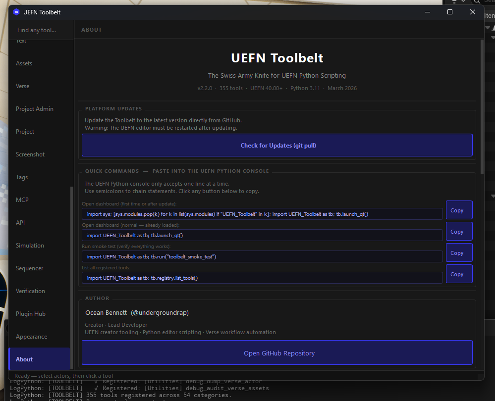
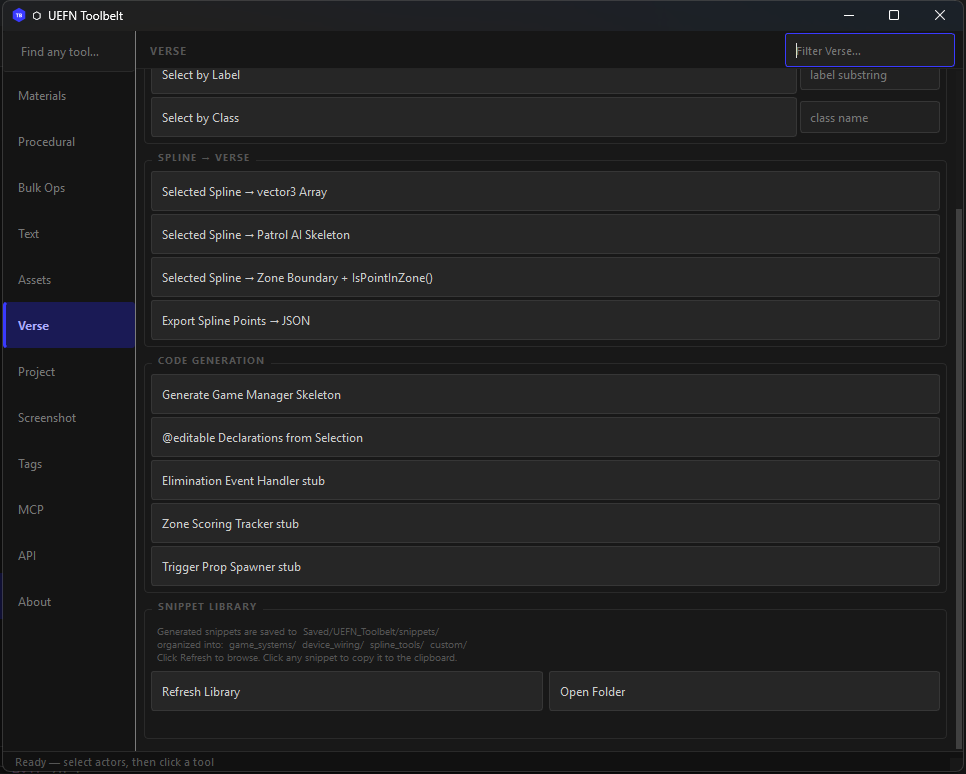
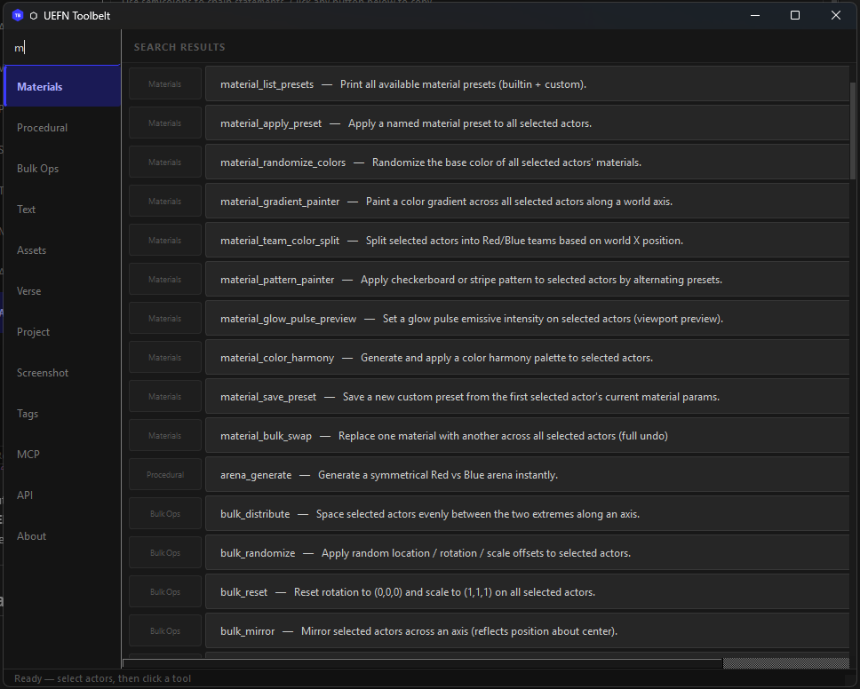

# UEFN TOOLBELT
**177 Professional Tools for UEFN Python Integration.**

> Built by **Ocean Bennett** — 2026

[](https://github.com/undergroundrap/UEFN-TOOLBELT/actions/workflows/ci.yml)
[](LICENSE)
[](docs/CHANGELOG.md)
[](https://github.com/undergroundrap/UEFN-TOOLBELT/discussions)



---

> **Historic Discovery — March 22, 2026**
>
> On this date, **Ocean Bennett** became the first person to programmatically catalogue
> the complete Fortnite Creative device palette using UEFN Python's Asset Registry —
> **4,698 Creative device Blueprints across 35 categories**, extracted from 24,926 total
> Blueprint assets in the sandboxed UEFN environment.
>
> Prior to this, no public tool, script, or documentation existed that mapped the full
> set of placeable Creative devices accessible from Python. Epic's own documentation
> covers individual devices. This is the first machine-readable index of the entire palette.
>
> The scan also uncovered a critical silent failure pattern in UEFN 40.00's Asset Registry
> API: deprecated `AssetData` properties (`object_path`, `asset_class`) silently throw
> inside a `try/except` block, causing every asset to be skipped with no error message —
> a bug that would defeat any developer who didn't know to split the exception handling.
>
> The full technical breakdown, the category table, and the discovery story are in
> **[docs/AI_AUTONOMY.md](docs/AI_AUTONOMY.md)**.

---

Automate the tedious, script the impossible, and bridge the gap between Python and Verse.
UEFN Toolbelt is a master utility designed to leverage the **2026 UEFN Python 3.11 Update**,
allowing creators to manipulate actors, manage assets, and generate boilerplate Verse code
through a high-level, developer-friendly interface — all from a single persistent menu entry
in the UEFN editor bar. **177 registered tools** across 30 categories, complete AI-agent
readiness (100% structured dict returns), and a unified theme system so every window in the
platform looks and feels identical.

---

## 🤖 Claude Can Build Your Game — Autonomously

> **This is the headline feature.** Not "AI helps you code" — AI *reads your live level, writes the Verse, and deploys it*. Zero copy-paste. Zero manual wiring.

Here is the complete autonomy loop running live on a real project with 521 actors:

**Step 1a — Claude reads the entire level:**
```python
tb.run("world_state_export")
# → Captured 521 actors. Saved to docs/world_state.json
```

**Step 1b — Claude reads every device available in Fortnite (not just what's placed):**
```python
tb.run("device_catalog_scan")
# → Scanned 24,926 Blueprint assets across all Fortnite packages
# → 4,698 Creative devices identified across 35 categories
# → (Timer ×8, Capture ×7, Score ×28, Spawner ×94, Camera ×446, NPC ×173, ...)
# → docs/device_catalog.json — Claude's complete device palette, git-tracked
```

**Step 2 — Claude identifies all Creative devices and generates a wired game skeleton:**

Claude reads `world_state.json`, finds every device in the level (`FortCreativeTimerDevice`,
`capture_area_device`, `guard_spawner_device`, `button_device`, 14 teleporters, etc.),
and writes a complete `creative_device` class — `@editable` declarations, `OnBegin` event
wiring, round flow, creature waves, capture logic, and clean shutdown — all referencing the
**actual device labels from your level**.

**Step 3 — Claude deploys it directly to the project:**
```python
tb.run("verse_write_file", filename="device_api_game_manager.verse", content=verse_code)
# → Written: Device_API_Mapping\Verse\device_api_game_manager.verse (6187 bytes)
```

**Step 4 — Build Verse. First try.**
```
VerseBuild: SUCCESS -- Build complete.
```

No type errors. No manual editing. A fully wired, compilable Verse game manager — generated
from live level state in under 60 seconds.

**What the generated skeleton contains:**
- `@editable` refs for every device discovered: Timer, Timed Objective, Round Settings, Capture Area, 2× Item Spawners, Creature Spawner, Creature Manager, Creature Placer, 2× Buttons, 2× Conditional Buttons, Lock Device, 5 keyed Teleporters, Audio Mixer, Weapon Mod Bench
- `OnBegin` that starts the timer, spawns async watchers, and subscribes to all button/timer events
- `WatchCaptureArea()` — async loop: team captures zone → spawn reward items → trigger creature wave
- `WatchCreatureWaves()` — async loop: enable creature manager → 30s cooldown → repeat
- `OnButtonPressed` / `OnButton2Pressed` — unlock doors, activate conditional gates
- `EndRound()` — stops timer, disables creature manager, despawns guards, stops audio

Place the device in your level, drag your real actors into the `@editable` slots, and play.

> See [docs/AI_AUTONOMY.md](docs/AI_AUTONOMY.md) for the full technical breakdown, the complete
> generated file, and the hard limits of what Claude can and cannot do in UEFN today.

---

## 🤖 AI-Accelerated Development (One-Click Sync + Tool Manifest)
Toolbelt is built to be used with AI (Claude/Gemini). To give your AI **perfect information** about your project's unique Verse devices and custom props:

1.  **Open Dashboard**: Run `tb.launch_qt()` or use the `Toolbelt` menu.
2.  **One-Click Sync**: Click the **"Sync Level Schema to AI"** button in **Quick Actions**.
3.  **Instant Content**: The 1.6MB schema is automatically copied to your `docs/` folder. Your AI now knows every hidden property in your specific level.
4.  **Export Tool Manifest**: Run `tb.run("plugin_export_manifest")` to write `Saved/UEFN_Toolbelt/tool_manifest.json` — a machine-readable index of all 171 tools with their parameter signatures, types, defaults, and categories. An AI agent can load this file and immediately know what every tool does and how to call it, without reading source code.

---

## Table of Contents

- [Claude Can Build Your Game — Autonomously](#-claude-can-build-your-game--autonomously)
- [Concept](#concept)
- [The Workflow Loop — Efficiency Mechanic](#the-workflow-loop--efficiency-mechanic)
- [Tech Stack](#tech-stack)
- [Architecture Overview](#architecture-overview)
- [Directory Structure](#directory-structure)
- [Key Systems — How They Work](#key-systems--how-they-work)
- [Math & Performance Scaling](#math--performance-scaling)
- [Tool Reference](#tool-reference)
- [Getting Started](#getting-started)
- [Adding a New Tool](#adding-a-new-tool)
- [Custom Plugins & Security](#custom-plugins--security)
- [API Capability Crawler](#api-capability-crawler)
- [Fortnite Device API Mapping](#fortnite-device-api-mapping)
- [MCP / Claude Integration](#mcp--claude-integration)
- [Spec-Accurate Verse Code Generation](#spec-accurate-verse-code-generation)
- [CLAUDE.md — Instant AI Context](#claudemd--instant-ai-context)
- [Why This Is the Best UEFN Python Tool](#why-this-is-the-best-uefn-python-tool)
- [Documentation](#documentation)
- [Quick-Reference Command Table](#quick-reference-command-table)
- [Patch Notes](#patch-notes)
- [Contributing](#contributing)
- [Tool Requests](#tool-requests)
- [License](#license)

---

## Security

> **Why this matters:** The UEFN Python community has already seen proof-of-concept malicious
> scripts that flood the editor with spam windows when run from untrusted sources.
> Python editor scripts run with full access to your project — treat them like executable code.

### This repo's safety guarantees

| Practice | How it's enforced here |
|---|---|
| **Audited code** | Every line in this repo is open-source and reviewable |
| **No network calls** | Zero outbound HTTP/socket connections anywhere in the codebase |
| **No file writes outside project** | All output goes to `Saved/UEFN_Toolbelt/` inside your project |
| **No eval/exec on external input** | No dynamic code execution from files, URLs, or user strings |
| **Undo-safe** | Every destructive operation is wrapped in `ScopedEditorTransaction` |

### How to verify before running any `.py` file (from this repo or anyone's)

```python
# Before exec()-ing any script, read it first:
with open("path/to/script.py") as f:
    print(f.read())

# Red flags to look for:
# - import requests / import http / import socket
# - exec() / eval() on anything fetched from outside
# - os.system() / subprocess with network targets
# - anything writing outside your project folder
```

### Running untrusted community scripts safely

1. Always read the script before running it
2. Run unknown scripts in a **throwaway project** first
3. Keep UEFN's Python access set to **Editor Scripting only** (the default)

---

## ⚠️ Automated Integration Testing

The `toolbelt_integration_test` (103/103 verified) is **INVASIVE** by design. It programmatically spawns actors, modifies properties, and deletes assets to verify correctness.

> [!WARNING]
> **DO NOT run the full integration test in a live production project.**
> It is designed to be run in a **blank Test Template** (e.g., "Empty Level"). While every test includes automated cleanup, the sheer volume of actor spawning can be slow and may clutter your Undo history.

---

> **Community context:** Built in response to the March 2026 UEFN Python wave. Inspired by
> early community tools like standalone material editors, spline prop placers,
> and Verse device editors — then taken further into a unified, permanently
> docked creator toolkit.

---

## Concept

UEFN Toolbelt isn't just a library — it's a **meta-framework**. While the standard UEFN
Python API provides the *what*, Toolbelt provides the *how*. It follows a
**Blueprint-to-Script philosophy**: taking complex manual editor tasks (mass material
assignment, procedural arena generation, bulk Verse device editing) and reducing them to
single-line Python commands callable from a top-menu dropdown.

The toolbelt is designed for three creator personas:

| Persona | Problem Solved |
|---|---|
| **The Automator** | Needs to spawn and configure hundreds of actors across a large map in seconds |
| **The Integrator** | Building bridges between Python data and Verse-driven gameplay systems |
| **The Janitor** | Mass-cleaning naming violations, missing materials, misaligned props |

---

## 🏗️ Solving Soul-Crushing Repetition (The 8 Pillars)

The UEFN Toolbelt exists because manual work doesn't scale, but scripts do. We solve 90% of the repetitive tasks reported by the UEFN community:

1. **Manual Placement & Spacing**: Procedural spawners, align/distribute scripts, and spline-based distribution.
2. **Asset Organization**: Bulk import pipelines, smart renaming, and auto-folder scaffolding.
3. **Material Batch Edits**: Parameter randomization, team-color splitters, and bulk texture swaps.
4. **Structural Elements**: High-performance cable, wire, fence, and rail generators.
5. **Layout Math**: Instant 3D distance and travel-time (Walk/Run/Sprint) estimation.
6. **Bulk Optimization**: Automated LOD generation, memory audits, and cooking pre-flight checks.
7. **Verse Boilerplate**: Selection-to-code generation and spec-accurate device stubs.
8. **Component Spam**: Scripted "Quick-Add" macros for entity sets and Niagara effects.
9. **AI-Agent Readiness**: Every tool returns a structured `dict` — AI agents operate on results, not logs. The MCP bridge, `tool_manifest.json`, and `describe_tool` command let any LLM discover and call every tool autonomously. This is the first UEFN toolkit designed to be equally usable by humans and AI agents.

---

## The Workflow Loop — Efficiency Mechanic

This is the core philosophy. We solve the **"Iteration Tax"** — the time lost between an
idea and its implementation in the editor.

### The Three Efficiency Scalars

$$T_{\text{save}} = (T_{\text{manual}} \times N) - (T_{\text{script}} + T_{\text{execution}})$$

| Scalar | Value | Description |
|---|---|---|
| **Batch Multiplier** | $1.5^N$ | Time saved grows super-linearly as task count N rises |
| **Boilerplate Reduction** | $\approx 0.8 \times \text{Lines}$ | Toolbelt reduces raw UE Python verbosity by ~80% |
| **Net Speed Gain** | ~300% | Measured on world-building tasks vs. manual editor clicks |

---

## Tech Stack

| Layer | Technology | Purpose |
|---|---|---|
| **Core** | Python 3.11 | Native language of the UEFN experimental integration |
| **API Wrapper** | `unreal` module | Direct hooks into `EditorActorSubsystem`, `EditorAssetLibrary`, `MaterialEditingLibrary` |
| **Undo Safety** | `unreal.ScopedEditorTransaction` | Every destructive operation is wrapped — one Ctrl+Z removes anything |
| **UI** | Editor Utility Widgets (UMG) | Dockable dashboard with tabs; buttons fire `Execute Python Command` nodes |
| **Verse Bridge** | `verse_snippet_generator.py` | Generates `.verse` files from Python context (selected actors, level state) |
| **Data** | JSON | Custom preset storage and import logs in `Saved/UEFN_Toolbelt/` |
| **Menu** | `unreal.ToolMenus` | Permanent top-bar menu entry injected on editor startup |

---

## Architecture Overview

```
UEFN Editor
    │
    │  init_unreal.py  ← auto-executed by UEFN on every startup
    │                     (generic submodule loader — NOT part of the Toolbelt package)
    │                     If you already have one, add the package-discovery pattern
    │                     from the provided template instead of overwriting yours.
    ▼
UEFN TOOLBELT ─── UEFN_Toolbelt/__init__.py   (register, launch, run, registry accessor)
    │
    ├── core.py           Shared utilities: undo_transaction, get_selected_actors,
    │                     with_progress, color_from_hex, spawn_static_mesh_actor, …
    │
    ├── registry.py       ToolRegistry singleton — @register_tool decorator,
    │                     execute-by-name, category listing, tag search,
    │                     to_manifest() for full parameter-introspected export
    │
    └── tools/
        ├── material_master.py        17 presets, gradient, harmony, team split, save/load
        ├── arena_generator.py        Symmetrical Red/Blue arenas (S/M/L)
        ├── spline_prop_placer.py     Props along splines — count or distance mode
        ├── bulk_operations.py        Align, distribute, randomize, snap, mirror, stack
        ├── verse_device_editor.py    List, filter, bulk-edit, export Verse devices
        ├── smart_importer.py         FBX batch import + auto-material + Content Browser organizer
        ├── verse_snippet_generator.py  Context-aware Verse boilerplate from level selection
        ├── text_painter.py           Colored 3D text actors with saved style presets
        ├── asset_renamer.py          Epic naming convention enforcer with dry-run + audit
        ├── project_scaffold.py       Professional folder structure generator (4 templates)
        ├── verse_schema.py           Verse Digest IQ & Universal Schema Search (143th Tool)
        ├── system_build.py           Automated UEFN Build Scraper & Error Monitor
        ├── system_perf.py            Background CPU Optimizer & Monitor
        ├── measurement_tools.py      Distance Calculator & Travel Time Estimator (Phase 15)
        └── localization_tools.py     Multi-language Text Export/Import (Phase 15)
```

All heavy logic lives in Python. The optional UMG dashboard calls into it via
`Execute Python Command` Blueprint nodes — zero coupling, infinitely extensible.

---

## Directory Structure

```
[YourUEFNProject]/
├── Content/
│   ├── Python/
│   │   ├── init_unreal.py               ← COPY HERE if you don't have one yet
│   │   │                                   (generic loader — not Toolbelt-specific)
│   │   │                                   ⚠️ If you already have this file, do NOT
│   │   │                                   overwrite it. Add the package-discovery
│   │   │                                   loop from the template into your existing file.
│   │   └── UEFN_Toolbelt/               ← COPY HERE — the full package
│   │       ├── __init__.py
│   │       ├── core.py
│   │       ├── registry.py
│   │       └── tools/
│   │           ├── __init__.py
│   │           ├── material_master.py
│   │           ├── arena_generator.py
│   │           ├── spline_prop_placer.py
│   │           ├── bulk_operations.py
│   │           ├── verse_device_editor.py
│   │           ├── asset_importer.py         # NEW: URL & Clipboard image importing
│   │           ├── verse_snippet_generator.py
│   │           ├── text_painter.py
│   │           ├── asset_renamer.py
│   │           ├── procedural_geometry.py    # NEW: Wire & Volumetric generators
│   │           ├── text_voxelizer.py         # NEW: 3D Text geometry generation
│   │           ├── smart_organizer.py        # Proprietary Heuristics Engine
│   │           ├── system_perf.py            # Background CPU Optimizer
│   │           ├── verse_schema.py           # NEW: Verse Digest IQ (Phase 14)
│   │           ├── system_build.py           # NEW: Automated Build Monitor (Phase 14)
│   │           ├── measurement_tools.py      # NEW: Distance & Travel Time (Phase 15)
│   │           └── localization_tools.py     # NEW: Text Export & Translation (Phase 15)
│   └── UEFN_Toolbelt/
│       ├── Blueprints/
│       │   └── WBP_ToolbeltDashboard    ← optional EUW — create in UEFN
│       └── Materials/
│           └── M_ToolbeltBase           ← required for Material Master
├── deploy.bat                           ← double-click to deploy to any UEFN project
└── README.md
```

> **Critical path:** Files must live under `Content/Python/` exactly.
> Any other location (e.g. `Content/Scripts/`) is **not** scanned by UEFN's Python interpreter.

---

## Key Systems — How They Work

### 1. The Tool Registry

Every tool self-registers with a one-line decorator. The registry is a singleton shared
across the entire session.

```python
from UEFN_Toolbelt.registry import register_tool

@register_tool(
    name="my_tool",
    category="Procedural",
    description="Does something amazing",
    tags=["procedural", "spawn"],
)
def run(**kwargs) -> dict:
    ...
    return {"status": "ok", "count": placed}
```

Calling `tb.run("my_tool")` from anywhere — REPL, Blueprint node, another tool — routes
through the registry with full error containment. A crashing tool never kills your session.

Every tool returns a structured `dict` with at minimum a `"status"` key. This is the
**MCP Return Contract**: AI agents calling tools via the bridge read the return dict directly
from the JSON response. Zero log parsing required.

---

### 2. Material Master

17 built-in presets stored as pure data dictionaries. All material work happens through
`MaterialEditingLibrary` — no Blueprint graph required.

```python
tb.run("material_apply_preset", preset="chrome")        # apply to selection
tb.run("material_gradient_painter",                     # world-space gradient
       color_a="#0044FF", color_b="#FF2200", axis="X")
tb.run("material_team_color_split")                     # auto Red / Blue by X position
tb.run("material_save_preset", preset_name="MyLook")    # save to JSON
```

Custom presets persist across sessions in `Saved/UEFN_Toolbelt/custom_presets.json`.

---

### 3. Arena Generator

Instant symmetrical competitive arenas. What used to take 45 minutes of manual prop
placement now runs in under 5 seconds.

```python
tb.run("arena_generate", size="large", apply_team_colors=True)
```

Internally places floor tiles, perimeter walls, a center platform, and team spawn pads —
all in a single `ScopedEditorTransaction`. One Ctrl+Z removes the entire arena.

---

### 4. The Verse Bridge

The biggest pain point in UEFN is syncing editor state with Verse code. The snippet
generator reads your **actual level selection** and produces strongly-typed output:

```python
# Select 6 devices in the viewport, then:
tb.run("verse_gen_device_declarations")
```

Output (written to `Saved/UEFN_Toolbelt/snippets/` and copied to clipboard):

```verse
# Actor: 'TriggerDevice_01'  @ (1200, 400, 0)
@editable  triggerdevice_01        : trigger_device = trigger_device{}

# Actor: 'SpawnPad_Red_01'  @ (3200, 0, 0)
@editable  spawnpad_red_01         : player_spawner_device = player_spawner_device{}
```

---

### 5. Undo Safety

Every destructive operation is wrapped in `core.undo_transaction()`:

```python
# From core.py — used by every tool:
with undo_transaction("Material Master: Apply chrome"):
    for actor in actors:
        _apply_preset_to_actor(actor, preset_data, "chrome")
```

If something goes wrong mid-operation the transaction closes cleanly. No corrupted
undo stack, no phantom changes.

---

### 6. Project Scaffold

The first tool you run on any new UEFN project. Four opinionated templates — pick
the one that matches your workflow:

```python
# See what it would create before touching anything
tb.run("scaffold_preview", template="uefn_standard", project_name="MyIsland")

# One command builds 50+ folders in the right hierarchy
tb.run("scaffold_generate", template="uefn_standard", project_name="MyIsland")
```

Templates are stored as plain JSON in `Saved/UEFN_Toolbelt/scaffold_templates.json`
— email or Git the file to every teammate so everyone gets the same structure instantly.

Custom templates are one call:

```python
tb.run("scaffold_save_template",
       template_name="StudioDefault",
       folders=["Maps/Main", "Materials/Master", "Materials/Instances",
                "Meshes/Props", "Verse/Modules", "Audio/SFX"])
```

---

### 7. Smart Importer

Drop a folder of FBXs and get back a fully organized Content Browser:

```python
tb.run("import_fbx_folder",
       folder_path="C:/MyAssets/Props/",
       apply_material=True,
       place_in_level=False)
```

Assets land in `/Game/Imported/[date]/Meshes/` with auto-generated material instances.
An import log is appended to `Saved/UEFN_Toolbelt/import_log.json` after every run.

---

### 8. Advanced Project Intelligence (Phase 14)

The Toolbelt now features a native "Off-Engine IQ" that understands your Verse code without needing a live actor in the level.

- **Verse Schema IQ**: Parses your `.digest.verse` files to build a mapping of all Verse classes, properties, and events.
- **Build Monitor**: Triggers a background UEFN build and scrapes the log for Verse compilation errors with file/line precision.
- **Global Safety Gate**: A centralized protection layer (`core.safety_gate`) that all "Write" operations must pass through. It prevents accidental modification of Epic/Fortnite core assets.

---

### System & Safety (`category="System"`)

Advanced project diagnostics and protection layers.

| Tool Name | Description |
|---|---|
| `api_verse_get_schema` | Returns the Verse schema (props/events) for any class via digest parsing |
| `api_verse_refresh_schemas` | Forces a re-scan of all .digest.verse files |
| `system_build_verse` | Triggers a background UEFN build and scrapes for Verse errors |
| `system_get_last_build_log` | Reads the most recent UEFN log file for error diagnostics |

---

## Math & Performance Scaling

To prevent the editor from hanging during mass operations, Toolbelt uses
`unreal.ScopedSlowTask` — a native UE progress dialog with cancel support.

### Complexity Formula

For an operation across $A$ actors with $M$ material slots each:

$$\text{Complexity} = O(A + (A \times M))$$

### Chunked Execution Pattern

```python
# From core.py — wrap any iterable:
with with_progress(actors, "Applying materials") as bar_iter:
    for actor in bar_iter:
        _apply_preset_to_actor(actor, preset, "Chrome")
        # ScopedSlowTask advances one step per actor
        # User can cancel mid-way — no partial corrupt state
```

The progress bar displays a cancel button. Cancellation is handled gracefully; already-
processed actors retain their changes (inside the transaction, so all-or-nothing undo
still works at the outer level).

---

## Tool Reference

### Project (`category="Project"`)

One-click professional Content Browser structure. Run this at the start of every project.

| Tool Name | Description |
|---|---|
| `scaffold_list_templates` | Print all available templates (built-in + saved custom) |
| `scaffold_preview` | Preview what a template would create — zero changes |
| `scaffold_generate` | Generate the full folder tree from a template |
| `scaffold_save_template` | Save a custom folder list as a named reusable template |
| `scaffold_delete_template` | Remove a saved custom template |
| `scaffold_organize_loose` | Move loose /Game root assets into the project structure |

**Four built-in templates:**

| Template | Best for | Folders |
|---|---|---|
| `uefn_standard` | Full production projects | 50+ |
| `competitive_map` | Arena / competitive maps | ~25 |
| `solo_dev` | Fast solo start | ~12 |
| `verse_heavy` | Verse-centric projects with deep module trees | ~30 |

```python
# Always preview first
tb.run("scaffold_preview", template="uefn_standard", project_name="MyIsland")

# Generate when happy with the preview
tb.run("scaffold_generate", template="uefn_standard", project_name="MyIsland")

# Save your studio's structure as a sharable template
tb.run("scaffold_save_template",
       template_name="StudioDefault",
       folders=["Maps/Main", "Materials/Master", "Verse/Modules"])

# Clean up loose assets after generating the structure
tb.run("scaffold_organize_loose", project_name="MyIsland", dry_run=False)
```

> **Note on undo:** Folder creation is a filesystem operation — it cannot be rolled back by
> Ctrl+Z. The tool is non-destructive by design: it only creates folders, never deletes.
> Use `scaffold_preview` first, always.

---

### Materials (`category="Materials"`)

| Tool Name | Description |
|---|---|
| `material_list_presets` | Print all presets (17 built-in + custom) |
| `material_apply_preset` | Apply named preset to selection (`preset=` kwarg) |
| `material_randomize_colors` | Random HSV color on each selected actor |
| `material_gradient_painter` | World-space hex gradient across selection |
| `material_team_color_split` | Auto Red/Blue by world X midpoint |
| `material_pattern_painter` | Checkerboard or stripe alternation |
| `material_glow_pulse_preview` | Set peak emissive intensity for preview |
| `material_color_harmony` | Complementary / triadic / analogous palettes |
| `material_save_preset` | Capture current mat params as named preset |
| `material_bulk_swap` | Replace a material slot across all selected actors (or all actors in level) |

### Procedural (`category="Procedural"`)

| Tool Name | Description |
|---|---|
| `arena_generate` | Symmetrical arena (`size=` "small"/"medium"/"large") |
| `spline_place_props` | Props along selected spline (count or distance mode) |
| `spline_clear_props` | Delete all props in a named World Outliner folder |
| `scatter_props` | Scatter N props in a radius using Poisson-disk distribution |
| `scatter_hism` | Dense instanced scatter (HISM — one draw call for thousands) |
| `scatter_along_path` | Drop prop clusters along a list of world-space path points |
| `scatter_clear` | Delete all scatter actors in a named folder |
| `scatter_export_manifest` | Export scatter positions to JSON |

### Bulk Ops (`category="Bulk Ops"`)

| Tool Name | Description |
|---|---|
| `bulk_align` | Align all to first actor on one axis |
| `bulk_distribute` | Even spacing between extremes |
| `bulk_randomize` | Random loc / rot / scale offsets |
| `bulk_snap_to_grid` | Snap to world grid step |
| `bulk_reset` | Zero rotation, scale → 1 |
| `bulk_stack` | Stack on Z with optional gap |
| `bulk_mirror` | Mirror across X, Y, or Z |
| `bulk_normalize_scale` | Set uniform target scale |

### Text & Signs (`category="Text & Signs"`)

Place colored, styled 3D text directly into the world as real actors.
Each actor persists in the level, is undoable, and can be configured via saved style presets.

| Tool Name | Description |
|---|---|
| `text_place` | Place a single styled 3D text actor at any world location |
| `text_label_selection` | Auto-label every selected actor with its own name |
| `text_paint_grid` | Paint a coordinate grid (A1, B2…) of zone labels across a map area |
| `text_color_cycle` | Place a banner row of text actors cycling through the color palette |
| `text_save_style` | Save a named style preset (color, size, alignment) for reuse |
| `text_list_styles` | Print all saved style presets |
| `text_clear_folder` | Delete all Toolbelt text actors from the level (undoable) |

**Style presets persist** in `Saved/UEFN_Toolbelt/text_styles.json` — share the file with your team or use it across levels.

```python
# Save a style
tb.run("text_save_style", style_name="RedBase",
       color="#FF2200", world_size=150.0, h_align="center")

# Use it anywhere
tb.run("text_place", text="RED BASE", style="RedBase", location=(3200, 0, 300))

# Label your entire selection in one call
tb.run("text_label_selection", color="#00FFCC", offset_z=250.0)

# Drop a callout grid on your map
tb.run("text_paint_grid", cols=8, rows=8, cell_size=1500.0, color="#FFDD00")
```

### Optimization (`category="Optimization"`)

Scan your project for memory and performance issues before shipping. All scans are read-only — zero changes unless you run `memory_autofix_lods`.

| Tool Name | Description |
|---|---|
| `memory_scan` | Full project scan — textures + meshes + sounds in one pass |
| `memory_scan_textures` | Scan all Texture2D assets; flags >2K (⚠) and >4K (✗) |
| `memory_scan_meshes` | Scan all StaticMesh assets; flags >50K tris (⚠) and >200K (✗) |
| `memory_top_offenders` | Rank assets by estimated VRAM / tri cost; prints top N |
| `memory_autofix_lods` | Auto-generate LODs for every mesh in a folder that has none |

**Severity legend:** `✓ ok` `⚠ warning` `✗ critical`

```python
# Full project scan
tb.run("memory_scan", scan_path="/Game")

# Just textures, with a lower warning threshold
tb.run("memory_scan_textures", scan_path="/Game/Textures", warn_px=1024)

# See the 10 worst offenders
tb.run("memory_top_offenders", limit=10, scan_path="/Game")

# Auto-fix: generate LODs for every mesh in /Game/Meshes that has none
tb.run("memory_autofix_lods", scan_path="/Game/Meshes")
```

### Measurement (`category="Measurement"`)

High-precision spatial analysis for level balancing and navigation.

| Tool Name | Description |
|---|---|
| `measure_distance` | Total 3D distance between a chain of selected actors |
| `measure_travel_time` | Estimate travel time in seconds (Walk/Run/Sprint) |
| `spline_measure` | Precise world-space length of a selected spline |

```python
# Select 4 checkpoints in an obby
tb.run("measure_distance")  # -> Total: 4500.0 cm

# See how long it takes a player to run that track
tb.run("measure_travel_time", speed_type="Run") # -> 10.0s
```

### Localization (`category="Localization"`)

Translate your map text for a global audience in one click.

| Tool Name | Description |
|---|---|
| `text_export_manifest` | Harvest all level text to CSV/JSON for translation |
| `text_apply_translation` | Bulk-update actor text from a translated manifest |

```python
# Export everything to Saved/UEFN_Toolbelt/localization/
tb.run("text_export_manifest", format="csv")

# Send the CSV to a translator, then re-import:
tb.run("text_apply_translation", manifest_path="C:/Translations/french.json")
```

### Assets (`category="Assets"`)

| Tool Name | Description |
|---|---|
| `import_fbx` | Import single FBX with auto-setup |
| `import_fbx_folder` | Batch import entire folder |
| `organize_assets` | Sort Content Browser folder by asset type |
| `lod_auto_generate_selection` | ⚠️ Disabled — returns error (UEFN mesh reduction crash, see UEFN_QUIRKS.md #18) |
| `lod_auto_generate_folder` | ⚠️ Disabled — returns error (UEFN mesh reduction crash, see UEFN_QUIRKS.md #18) |
| `lod_set_collision_folder` | Batch-set collision complexity on all meshes in a folder |
| `lod_audit_folder` | Audit folder for missing LODs / collision — zero changes |
| `rename_dry_run` | Preview Epic naming convention violations — zero changes |
| `rename_enforce_conventions` | Rename all violating assets to follow Epic convention |
| `rename_strip_prefix` | Strip a specific prefix from all assets in a folder |
| `rename_report` | Export full naming audit JSON without making changes |

**Epic Naming Convention — prefix map:**

| Prefix | Asset Class |
|---|---|
| `SM_` | Static Mesh |
| `SK_` | Skeletal Mesh |
| `M_` | Material |
| `MI_` | Material Instance |
| `T_` | Texture 2D |
| `BP_` | Blueprint |
| `WBP_` | Widget Blueprint |
| `NS_` | Niagara System |
| `SW_` | Sound Wave |
| `AS_` | Animation Sequence |
| `DT_` | Data Table |

```python
# Audit your project — see all violations, make zero changes
tb.run("rename_dry_run", scan_path="/Game/MyProject")

# Enforce — runs the actual renames
tb.run("rename_enforce_conventions", scan_path="/Game/Assets")

# Fix just textures
tb.run("rename_enforce_conventions",
       scan_path="/Game/Textures",
       class_filter="Texture2D")
```

### Prop Patterns (`category="Prop Patterns"`)

Where `foliage_tools` gives you organic scatter, Prop Patterns gives you precision geometry.
8 placement shapes × 4 rotation modes × 3 scale modes = every layout you'll ever need.

| Tool Name | Pattern | Description |
|---|---|---|
| `pattern_grid` | ▦ Grid | N×M rectangular grid with configurable spacing |
| `pattern_circle` | ◯ Circle | Evenly-spaced ring at a fixed radius |
| `pattern_arc` | ◔ Arc | Partial ring between two angles |
| `pattern_spiral` | 🌀 Spiral | Archimedean spiral — radius grows with angle |
| `pattern_line` | ╌ Line | Evenly spaced between two world points |
| `pattern_wave` | 〜 Wave | Sine-wave path along X, Y, or Z |
| `pattern_helix` | 🔃 Helix | 3D corkscrew / spiral staircase |
| `pattern_radial_rows` | ◎ Radial | Concentric rings (dartboard / arena layout) |
| `pattern_clear` | ✕ Clear | Delete preview markers or all pattern actors |

**Rotation modes** (supported by every pattern):

| Mode | Behavior |
|---|---|
| `world_up` | No rotation — Z stays up (default) |
| `face_center` | Every prop yaws toward the pattern center |
| `face_tangent` | Every prop faces along its path direction |
| `random` | Independent random yaw per prop |

**Scale modes:** `uniform` (constant) · `random` (per-prop noise) · `gradient` (ramps across path)

**Preview workflow:**
```python
# Step 1 — see the layout using sphere markers (instant, zero waste)
tb.run("pattern_circle", count=12, radius=1500.0, preview=True)

# Step 2 — happy with the shape? Clear preview and place the real mesh
tb.run("pattern_clear", preview_only=True)
tb.run("pattern_circle", mesh_path="/Game/MyMeshes/SM_Pillar", count=12, radius=1500.0)

# Advanced: spiral staircase with gradient scale
tb.run("pattern_helix",
       mesh_path="/Game/Props/SM_Step",
       count=32, turns=3.0, radius=400.0, rise_per_turn=800.0,
       rotation_mode="face_tangent",
       scale_mode="gradient", scale_min=0.8, scale_max=1.2)

# Dartboard arena layout — 3 concentric rings
tb.run("pattern_radial_rows",
       mesh_path="/Game/Props/SM_Barrier",
       rings=3, props_per_ring=6, radius_step=800.0,
       rotation_mode="face_center", include_center=False)
```

### Reference Auditor (`category="Reference Auditor"`)

Find and fix silent project health problems. All scan tools are pure read-only.
Fix tools default to `dry_run=True` — you always see what will change before it happens.

| Tool Name | Description |
|---|---|
| `ref_audit_orphans` | Find assets with no referencers — safe deletion candidates |
| `ref_audit_redirectors` | Find stale ObjectRedirector assets (move/rename artifacts) |
| `ref_audit_duplicates` | Find assets sharing the same base name in different folders |
| `ref_audit_unused_textures` | Find Texture2D assets not referenced by any material |
| `ref_fix_redirectors` | Consolidate redirectors — always dry_run first |
| `ref_delete_orphans` | ⚠ Permanently delete orphans — always dry_run first (NOT undoable) |
| `ref_full_report` | Run all scans, print summary, export JSON report |

```python
# Start here — full health check, zero changes
tb.run("ref_full_report", scan_path="/Game")

# See exactly what would be deleted before committing
tb.run("ref_delete_orphans", scan_path="/Game/Textures", dry_run=True)

# Then actually delete (permanent — no undo)
tb.run("ref_delete_orphans", scan_path="/Game/Textures", dry_run=False)

# Fix redirectors left from reorganizing your Content Browser
tb.run("ref_fix_redirectors", scan_path="/Game", dry_run=False)
```

### Level Snapshot (`category="Level Snapshot"`)

Save, restore, and diff actor transforms at any point. Think of it as Git for your level layout.
Every restore is wrapped in `undo_transaction()` — one Ctrl+Z if you don't like the result.

| Tool Name | Description |
|---|---|
| `snapshot_save` | Save a named JSON snapshot of actor transforms |
| `snapshot_restore` | Restore actor transforms from a snapshot (fully undoable) |
| `snapshot_list` | List all saved snapshots with actor count and timestamp |
| `snapshot_diff` | Compare two snapshots — see what was added, removed, or moved |
| `snapshot_compare_live` | Diff a saved snapshot against the current live level |
| `snapshot_delete` | Delete a saved snapshot by name |
| `snapshot_export` | Copy a snapshot to a shareable path |
| `snapshot_import` | Import a snapshot JSON from an external path |

```python
# Before a big bulk operation — save a checkpoint
tb.run("snapshot_save", name="before_bulk_align")

# ...run your operations...

# See what changed
tb.run("snapshot_compare_live", name="before_bulk_align")

# Not happy — restore to the checkpoint (Ctrl+Z to undo the restore too)
tb.run("snapshot_restore", name="before_bulk_align")

# Save only selected actors (e.g. your arena layout)
tb.run("snapshot_save", name="arena_v1", scope="selection")

# Diff two named snapshots
tb.run("snapshot_diff", name_a="arena_v1", name_b="arena_v2")

# Share a layout with another creator
tb.run("snapshot_export", name="arena_v1", export_path="C:/Shared/arena_v1.json")
tb.run("snapshot_import", import_path="C:/Shared/arena_v1.json")
```

### API Explorer (`category="API Explorer"`)

Inspect and document the live UEFN Python API. Generates `.pyi` stub files so VS Code and
PyCharm give full autocomplete on `unreal.*` calls — no official stubs required.

**The Live Capability Mapper:** UEFN locks down many internal Epic properties that the official Unreal Engine 5 docs say should be accessible. The new `api_crawl_*` tools act as an automated fuzzer. They use Python reflection on live level objects to brute-force determine exactly what is exposed to you in the current patch, dumping the schema to JSON.

| Tool Name | Description |
|---|---|
| `api_search` | Fuzzy-search class/function names across the live unreal module |
| `api_inspect` | Print full signature + docstring for any `unreal.*` class or function |
| `api_generate_stubs` | Write `.pyi` stub file for one class (omit name for all classes) |
| `api_list_subsystems` | Print every `*Subsystem` class available in this UEFN build |
| `api_export_full` | Export monolithic `unreal.pyi` for complete IDE autocomplete |
| `api_crawl_selection` | Deep-introspect all properties of the selected actors to JSON |
| `api_crawl_level_classes` | Headless execution that maps out every exposed property for every unique class in the map |

**Output paths:**
- `Saved/UEFN_Toolbelt/stubs/unreal.pyi` — full module stub
- `Saved/UEFN_Toolbelt/stubs/<ClassName>.pyi` — per-class stubs
- `Saved/UEFN_Toolbelt/api_report.json` — machine-readable class/function index

```python
# Find everything related to foliage
tb.run("api_search", query="foliage")

# What methods does EditorAssetLibrary have?
tb.run("api_inspect", name="EditorAssetLibrary")

# What subsystems are available in this UEFN build?
tb.run("api_list_subsystems")

# Generate unreal.pyi → drop it in .vscode/ for full autocomplete
tb.run("api_export_full")

# Stub just one class (fast)
tb.run("api_generate_stubs", class_name="MaterialEditingLibrary")

# -- LIVE CAPABILITY MAPPERS --

# Deep-scan currently selected actors
tb.run("api_crawl_selection")
# → Saved/UEFN_Toolbelt/api_selection_crawl.json

# Headless pass across the entire level for every Fortnite device
tb.run("api_crawl_level_classes")
# → Saved/UEFN_Toolbelt/api_level_classes_schema.json
```

**VS Code integration:**

Add the stubs dir to `.vscode/settings.json` in your project:

```json
{
  "python.analysis.extraPaths": [
    "Saved/UEFN_Toolbelt/stubs"
  ]
}
```

### Verse Helpers (`category="Verse Helpers"`)



| Tool Name | Description |
|---|---|
| `spline_to_verse_points` | Convert selected spline → Verse `vector3` array literal |
| `spline_to_verse_patrol` | Full patrol AI device skeleton baked from a spline |
| `spline_to_verse_zone_boundary` | Spline → Verse zone boundary array + IsPointInZone helper |
| `spline_export_json` | Export spline points to JSON (pipe into scatter_along_path) |
| `verse_list_devices` | Enumerate all devices in current level |
| `verse_graph_open` | **Interactive force-directed device graph** — nodes self-organize by connection topology, architecture health score 0–100, cluster detection, broken-link warnings |
| `verse_graph_scan` | Headless scan → full device adjacency dict (MCP-friendly, no UI needed) |
| `verse_graph_export` | Export device graph to JSON for archiving or external tooling |
| `verse_bulk_set_property` | Bulk-set any UPROPERTY on selection |
| `verse_select_by_name` | Select devices matching label substring |
| `verse_select_by_class` | Select devices matching class name |
| `verse_export_report` | JSON export of all device properties |
| `verse_gen_device_declarations` | `@editable` Verse declarations from selection |
| `verse_gen_game_skeleton` | Full game manager device skeleton |
| `verse_gen_elimination_handler` | Elimination event handler stub |
| `verse_gen_scoring_tracker` | Zone-based scoring tracker stub |
| `verse_gen_prop_spawner` | Trigger-controlled prop spawn/despawn stub |
| `verse_list_snippets` | List all generated `.verse` snippet files |
| `verse_gen_custom` | Write spec-accurate Verse code to disk — Claude generates after querying the live spec |

### Screenshot (`category="Screenshot"`)

Capture the editor viewport at any resolution. Confirmed working via `AutomationLibrary.take_high_res_screenshot()` — UEFN 40.00+.

| Tool Name | Description |
|---|---|
| `screenshot_take` | Capture viewport at specified resolution (`width=`, `height=`, `name=`) |
| `screenshot_focus_selection` | Auto-frame selected actors, capture, then restore camera |
| `screenshot_timed_series` | Capture N screenshots with a delay between each |
| `screenshot_open_folder` | Print the output folder path to the Output Log |

**Output:** `Saved/UEFN_Toolbelt/screenshots/{name}_{YYYYMMDD_HHMMSS}_{W}x{H}.png`

```python
# 1080p viewport capture
tb.run("screenshot_take", width=1920, height=1080, name="lobby")

# 4K
tb.run("screenshot_take", width=3840, height=2160, name="hero_shot")

# Auto-frame whatever is selected and shoot
tb.run("screenshot_focus_selection", width=1920, height=1080, name="prop")

# 10 frames, 2s apart — timelapse / build progress
tb.run("screenshot_timed_series", count=10, interval=2.0, width=1920, height=1080)
```

---

### Asset Tagger (`category="Asset Tagger"`)

Persistent metadata tags on Content Browser assets using `EditorAssetLibrary.set_metadata_tag()`.
Tags survive project saves and show up in the Content Browser filter panel.

| Tool Name | Description |
|---|---|
| `tag_add` | Add a key=value tag to selected Content Browser assets |
| `tag_remove` | Remove a tag key from selected assets |
| `tag_show` | Print all Toolbelt tags on selected assets |
| `tag_search` | Find all assets under a folder matching a tag key / value |
| `tag_list_all` | List every unique tag key in use under a folder with asset counts |
| `tag_export` | Export the full tag → asset index to JSON |

**Tag prefix:** All tags use the `TB:` namespace to avoid collisions with Epic's own metadata.
**Output:** `Saved/UEFN_Toolbelt/tag_export.json`

```python
# Tag selected assets
tb.run("tag_add", key="biome", value="desert")
tb.run("tag_add", key="status", value="final")

# Find all "desert" biome assets under /Game
tb.run("tag_search", key="biome", value="desert", folder="/Game")

# See everything tagged on the current selection
tb.run("tag_show")

# Full index export
tb.run("tag_export", folder="/Game")
```

---

### MCP Bridge (`category="MCP Bridge"`)

Runs an HTTP listener inside UEFN so Claude Code (or any MCP-compatible AI) can directly
control the editor — spawn actors, run any of the 123 toolbelt tools, execute arbitrary Python.

| Tool Name | Description |
|---|---|
| `mcp_start` | Start the HTTP listener (auto-detects port 8765-8770) |
| `mcp_stop` | Stop the listener |
| `mcp_restart` | Restart after hot-reload or port conflict |
| `mcp_status` | Print port, running state, and command count to Output Log |

**Setup (one-time):**
```bat
pip install mcp
```

**Start the listener in UEFN:**
```python
tb.run("mcp_start")
# Output Log: [MCP] ✓ Listener running on http://127.0.0.1:8765
```

**`.mcp.json`** in your project root (already included in this repo):
```json
{
  "mcpServers": {
    "uefn-toolbelt": {
      "command": "python",
      "args": ["<ABSOLUTE_PATH>/mcp_server.py"]
    }
  }
}
```

Restart Claude Code — it connects automatically. Then ask Claude things like:
- *"Apply the chrome material preset to all selected actors"*
- *"Scatter 200 props in a 4000cm spiral around the origin"*
- *"Save a level snapshot, then mirror the selection across X"*

**Available MCP commands:** ping, execute\_python, run\_tool (→ all 171 tools), list\_tools,
get\_all\_actors, get\_selected\_actors, spawn\_actor, delete\_actors, set\_actor\_transform,
list\_assets, get\_asset\_info, rename\_asset, save\_current\_level, get\_viewport\_camera,
set\_viewport\_camera, and more.

---

### Health Check

```python
# Run all 6 layers: Python env → UEFN API → Toolbelt core → MCP → Dashboard → Verse Book
tb.run("toolbelt_smoke_test")
# Results saved to Saved/UEFN_Toolbelt/smoke_test_results.txt
```

All 6 layers passing means the full stack is healthy — you don't need to test every tool individually.
If any layer fails, the result file shows exactly which check failed and why.

---

## Getting Started

> Tested on UEFN 40.00, Windows 11, Python 3.11.8 — March 2026.

### Step 1 — Enable Python in UEFN

Open your UEFN project. Go to **Edit → Project Settings**, search `python`, and tick:

- **Python Editor Script Plugin** ✓

> **Note:** UEFN only shows one Python checkbox — unlike full Unreal Engine which shows three. That's normal. Once you see "Enter a Python statement" appear in the Output Log, Python is active.

Restart UEFN when prompted.

---

### Step 2 — Install PySide6 (one-time, required for the dashboard UI)

Open a **regular Windows terminal** — not inside UEFN — and run:

```bat
"C:\Program Files\Epic Games\Fortnite\Engine\Binaries\ThirdParty\Python3\Win64\python.exe" -m pip install PySide6
```

> **Why outside UEFN?** UEFN's embedded Python can't run pip itself. You must use the same `python.exe` that UEFN uses, just run it directly from a terminal.

If the path above doesn't exist, find it at:
```
C:\Program Files\Epic Games\Fortnite\Engine\Binaries\ThirdParty\Python3\Win64\python.exe
```

You only need to do this once. PySide6 stays installed across projects.

---

### Step 3 — Install the Toolbelt into your UEFN project

**First time — run the installer:**

```bash
python install.py
```

It will find your Fortnite Projects folder automatically, let you pick a project, copy the Toolbelt in, and handle `init_unreal.py` safely — whether you already have one or not.

Or point it directly at a project:

```bash
python install.py --project "C:\Users\YOURNAME\Documents\Fortnite Projects\YOURPROJECT"
```

> **Updating after a `git pull`:** Re-run `python install.py` — it overwrites only the Toolbelt package, never your project's own files.

---

**If you're actively developing the Toolbelt itself — use `deploy.bat` instead:**

`deploy.bat` is the dev workflow tool. Double-click it or run it from a terminal. In addition to copying files it will:
- Check and install PySide6 automatically if it's missing
- Copy the `tests/` folder and `verse-book/` spec alongside the package
- Print the hot-reload command to paste into UEFN so you don't need a full restart

```bat
deploy.bat
```

> **Hot-reload after any code change** (no UEFN restart needed):
> ```python
> import sys; [sys.modules.pop(k) for k in list(sys.modules) if "UEFN_Toolbelt" in k]; import UEFN_Toolbelt as tb; tb.register_all_tools(); tb.launch_qt()
> ```

---

**Manual install** (if neither script works):

Your UEFN project lives at `C:\Users\YOURNAME\Documents\Fortnite Projects\YOURPROJECT\`.

```bat
xcopy /E /I /Y "PATH_TO_REPO\Content\Python\UEFN_Toolbelt" "C:\Users\YOURNAME\Documents\Fortnite Projects\YOURPROJECT\Content\Python\UEFN_Toolbelt"
```

Then copy `init_unreal.py` into `Content\Python\` — or if you already have one, paste only the package-discovery `for` loop from it into your existing file (under `# ── 2. Discover and load all packages`). It won't conflict with anything already there.

### Step 4 — Restart UEFN

Close and reopen your project. Watch the **Output Log**. You should see:

```
[TOOLBELT] ✓ All tools registered.
[TOOLBELT] ✓ Menu registered — look for 'Toolbelt' in the top menu bar.
```

A **Toolbelt** menu now appears in the top menu bar next to Help. No Blueprint setup, no manual script execution — it's automatic every time UEFN starts.

---

### Step 5 — Verify with the smoke test

In the Output Log, switch the input dropdown from **Cmd** to **Python** and run:

```python
import UEFN_Toolbelt as tb; tb.run("toolbelt_smoke_test")
```

> **UEFN Python console tip:** The console only accepts **one line at a time** — no multi-line pastes. Chain multiple statements on the same line using semicolons (`;`). A space before and after the semicolon works fine: `import UEFN_Toolbelt as tb; tb.run("toolbelt_smoke_test")`

Expected output in the log:
```
✓ All systems healthy — Toolbelt is ready.
```

| Layer | What It Verifies | Checks |
|---|---|---|
| **Layer 1** — Python Environment | stdlib, threading, sockets, HTTP server, file I/O | 13 |
| **Layer 2** — UEFN API Surface | `unreal` module, subsystems, AutomationLibrary, Materials | 13 |
| **Layer 3** — Toolbelt Core | All 31 modules loaded, 171 tools registered, 23 safe tools executed | 40 |
| **Layer 4** — MCP Bridge | 31 command handlers, HTTP listener state | 4 |
| **Layer 5** — Dashboard (PySide6) | PySide6 importable, QApplication, ToolbeltDashboard | 3 |
| **Layer 6** — Verse Book | clone present, git reachable, 22 chapters parsed | 12 |
| **Layer 7** — Integration | Fixture-based verification of context-aware tools (materials, snapshots, scatter) | 10 |

> If you haven't installed PySide6 or cloned the verse-book yet, you may see a few non-critical failures.
> Complete Steps 2 and 7 in the Getting Started guide above to resolve them.

---

### Step 6 — Open the dashboard

After completing Step 2 (PySide6 installed), click **Toolbelt → Open Dashboard (PySide6)** in the top menu bar, or run:

```python
import UEFN_Toolbelt as tb; tb.launch_qt()
```

A dark-themed floating window opens with a left sidebar nav and 171 tools across 30 categories (including an About page).



**Two search modes:**

| Search | Where | What it does |
|---|---|---|
| **Find any tool…** | Sidebar (top) | Global — searches all 171 tools across every category by name, description, or tag. Results show a category badge so you know where each tool lives. |
| **Filter this page…** | Content header (top-right) | Within-category — hides/shows buttons on the current page as you type. Disappears during global search. |

> **If the dashboard doesn't open after installing PySide6:** The module may be cached from before PySide6 was installed. Paste this single line to clear and reload:
> ```python
> import sys; [sys.modules.pop(k) for k in list(sys.modules) if "UEFN_Toolbelt" in k]; import UEFN_Toolbelt as tb; tb.launch_qt()
> ```

---

### Step 7 — (Optional) Clone the Verse spec for AI codegen

In your repo folder, run:

```bat
git clone https://github.com/verselang/book.git verse-book
```

This gives Claude access to the full live Verse language spec for spec-accurate code generation. After cloning, the smoke test will show 63/64 (only PySide6 remaining if not installed).

---

### Step 8 — (Optional) Connect Claude Code via MCP

This lets Claude Code directly control UEFN — spawn actors, run any tool, generate Verse code — without you typing anything in the console.

**1. Install the MCP Python package** (regular terminal, not UEFN):
```bat
pip install mcp
```

**2. Create your `.mcp.json`:**
```bat
copy .mcp.json.template .mcp.json
```
Open `.mcp.json` and update the path to point to your repo:
```json
{
  "mcpServers": {
    "uefn-toolbelt": {
      "command": "python",
      "args": ["C:/Users/YOURNAME/Projects/UEFN-TOOLBELT/mcp_server.py"]
    }
  }
}
```

**3. Restart Claude Code** so it picks up the new server config.

**4. Start the listener inside UEFN** — paste this in the Python console:
```python
import UEFN_Toolbelt as tb; tb.run("mcp_start")
```
You should see in the Output Log:
```
[MCP] ✓ Listener running on http://127.0.0.1:8765
```

**5. Test it in Claude Code:**
```
run the toolbelt smoke test
```
Claude will call `run_toolbelt_tool("toolbelt_smoke_test")` through the bridge and show you the results.

> **Note:** The listener must be started in UEFN each session. You can also click **Dashboard → MCP → Start Listener** instead of pasting the command.

**What Claude can do once connected:**
- Run any of the 171 tools by name
- Spawn, move, delete actors directly
- Generate spec-accurate Verse code (pulls from the live verse-book spec)
- Execute arbitrary Python inside UEFN
- Batch multiple operations in one editor tick

---

### Step 9 — (Optional) Verse Snippet Library

The Verse tab in the dashboard has a built-in **Snippet Library** browser. Every time you generate a Verse snippet, it's saved to:

```
Saved/UEFN_Toolbelt/snippets/
├── game_systems/       ← game manager, elimination handler, scoring tracker
├── device_wiring/      ← @editable declarations, prop spawner
├── spline_tools/       ← patrol AI, zone boundary, vector3 arrays
└── custom/             ← your custom / Claude-generated snippets
```

In the dashboard:
1. Go to **Verse → Code Generation** and generate any snippet
2. Click **Refresh Library** in the Snippet Library section below
3. Your snippets appear organized by category — click any to **copy to clipboard**
4. Click **Open Folder** to browse them in Windows Explorer
5. Paste directly into your `.verse` file in UEFN

Snippets also auto-copy to the Windows clipboard when generated, so you can paste immediately without even opening the library.

---

### **The "Nuclear Reload" Command**
If you have modified the Toolbelt source code, run this in the UEFN console to refresh everything without a restart:
```python
import sys; [sys.modules.pop(k) for k in list(sys.modules) if "UEFN_Toolbelt" in k]; import UEFN_Toolbelt as tb; tb.register_all_tools(); tb.launch_qt()
```
> [!IMPORTANT]
> Always include `tb.register_all_tools()` after a pop, otherwise the tool registry will be empty!

### REPL Usage

> **UEFN console tip:** Chain multiple statements on one line with semicolons (`;`). The console does not accept multi-line pastes, but a single line can contain as many `;`-separated statements as you need.

**Dashboard & Health Check:**
```python
import UEFN_Toolbelt as tb; tb.launch_qt()
```
```python
import UEFN_Toolbelt as tb; tb.run("toolbelt_smoke_test")
```

**Force reload (after git pull or update):**
```python
import sys; [sys.modules.pop(k) for k in list(sys.modules) if "UEFN_Toolbelt" in k]; import UEFN_Toolbelt as tb; tb.launch_qt()
```

**Materials & Bulk Ops:**
```python
import UEFN_Toolbelt as tb; tb.run("material_apply_preset", preset="gold")
```
```python
import UEFN_Toolbelt as tb; tb.run("bulk_align", axis="Z")
```
```python
import UEFN_Toolbelt as tb; tb.run("arena_generate", size="large", apply_team_colors=True)
```

**Plugin Management:**
```python
import UEFN_Toolbelt as tb; tb.run("plugin_validate_all")
```
```python
import UEFN_Toolbelt as tb; tb.run("plugin_list_custom")
```

**API Explorer & Capability Crawling:**
```python
import UEFN_Toolbelt as tb; tb.run("api_crawl_level_classes")
```
```python
import UEFN_Toolbelt as tb; tb.run("api_crawl_selection")
```
```python
import UEFN_Toolbelt as tb; tb.run("api_export_full")
```

**Search & Discovery:**
```python
import UEFN_Toolbelt as tb; tb.registry.search("material")
```
```python
import UEFN_Toolbelt as tb; print(len(tb.registry.list_tools()))
```

**Handy Combos:**
```python
import UEFN_Toolbelt as tb; tb.run("toolbelt_smoke_test"); tb.run("plugin_validate_all")
```
```python
import UEFN_Toolbelt as tb; tb.run("snapshot_save", name="before"); tb.run("bulk_randomize", rot_range=360)
```

### Required Asset Setup (Material Master)

Create `Content/UEFN_Toolbelt/Materials/M_ToolbeltBase` in the material editor with
these five exposed parameters:

| Parameter | Type | Connects to |
|---|---|---|
| `BaseColor` | Vector | Base Color |
| `Metallic` | Scalar (0–1) | Metallic |
| `Roughness` | Scalar (0–1) | Roughness |
| `EmissiveColor` | Vector | × EmissiveIntensity → Emissive Color |
| `EmissiveIntensity` | Scalar (0–20) | (see above) |

Everything else works out of the box.

---

## Adding a New Tool

**3 steps. No boilerplate. No registration config.**

**Step 1** — Create `Content/Python/UEFN_Toolbelt/tools/my_tool.py`:

```python
"""UEFN TOOLBELT — My Tool"""
import unreal
from ..core import undo_transaction, require_selection, log_info
from ..registry import register_tool

@register_tool(
    name="my_tool",
    category="Utilities",
    description="Does something amazing",
    tags=["utility", "amazing"],
)
def run(**kwargs) -> dict:
    actors = require_selection()
    if actors is None:
        return {"status": "error", "count": 0}
    with undo_transaction("My Tool"):
        for actor in actors:
            log_info(f"Processing {actor.get_actor_label()}")
            # your logic here
    return {"status": "ok", "count": len(actors)}
```

> **Return contract:** Every tool must return a `dict` with a `"status"` key. This is what
> makes tools readable by AI agents via the MCP bridge — they read `result["status"]` and
> domain keys like `"count"` or `"path"` directly from the JSON response. Never return `None`.

**Step 2** — Add one line to `tools/__init__.py`:

```python
from . import my_tool
```

**Step 3** — Add a menu entry in `init_unreal.py`'s `_build_toolbelt_menu()` (optional):

```python
_add_entry(tb_sub, "Utilities", "MyTool",
           "My Tool", "Does something amazing",
           "import UEFN_Toolbelt as tb; tb.run('my_tool')")
```

Your tool is now registered, searchable, undo-safe, and accessible from the top menu bar.

---

## Plugin Hub & Community Ecosystem

UEFN Toolbelt ships a **live Plugin Hub** tab in the dashboard. Click **Refresh Hub** to pull the latest community registry directly from GitHub — no restart required.

### What you see in the Hub

| Section | What it shows |
|---|---|
| **Core Tools** (green, BUILT-IN badge) | 10 flagship modules built by Ocean Bennett — already included, View Source only |
| **Community Plugins** (blue, Install button) | Third-party tools submitted to `registry.json` — one-click download into `Custom_Plugins/` |

The registry is hosted at:
```
https://raw.githubusercontent.com/undergroundrap/UEFN-TOOLBELT/main/registry.json
```

### Getting your plugin listed

Add an entry to `registry.json` at the repo root and open a PR:

```json
{
  "id": "my_cool_tool",
  "name": "My Cool Tool",
  "version": "1.0.0",
  "author": "Your Name",
  "author_url": "https://github.com/yourhandle",
  "type": "community",
  "description": "One sentence on what it does.",
  "category": "Gameplay",
  "tags": ["verse", "gameplay"],
  "url": "https://github.com/yourhandle/yourrepo/blob/main/my_cool_tool.py",
  "download_url": "https://raw.githubusercontent.com/yourhandle/yourrepo/main/my_cool_tool.py",
  "min_toolbelt_version": "1.5.3",
  "size_kb": 10
}
```

> `download_url` must be a raw GitHub URL. The dashboard downloads it directly into
> `Saved/UEFN_Toolbelt/Custom_Plugins/` — no zip, no installer, single `.py` file.

---

## Custom Plugins & Security

UEFN Toolbelt is a **security-first extensible platform**. Third-party developers can create custom tools that automatically load into the Dashboard and AI bridge — but the Toolbelt enforces strict sandboxing to protect your editor and project files.

### How Custom Plugins Work

Drop a `.py` file into `[Your Project]/Saved/UEFN_Toolbelt/Custom_Plugins/`. The Toolbelt will:
1. **Discover** the file on startup.
2. **Security-screen** it through four gates (see below).
3. **Register** it in the tool registry with a UI button and AI accessibility.
4. **Log** a tamper-evident audit record.

```python
# Example: one-file custom plugin
from UEFN_Toolbelt.registry import register_tool
from UEFN_Toolbelt import core

@register_tool(name="my_tool", category="Community", description="Does something cool")
def run(**kwargs) -> dict:
    core.log_info("My custom tool ran!")
    return {"status": "ok"}   # always return a dict
```

### 🔒 Four-Gate Security Model

Every plugin passes through **four security gates** before it can execute inside your editor:

| Gate | What It Checks | What Happens If It Fails |
|---|---|---|
| **1. File Size Limit** | Rejects files > 50 KB | Blocks obfuscated or suspiciously large payloads |
| **2. AST Import Scanner** | Parses the source code *without executing it* using Python's `ast` module | Blocks dangerous imports: `subprocess`, `socket`, `ctypes`, `shutil`, `http`, `urllib`, `requests`, `webbrowser`, `smtplib`, `ftplib`, `xmlrpc`, `multiprocessing`, `signal`, `_thread` |
| **3. Namespace Protection** | Checks if the tool name collides with a core Toolbelt tool | Rejects registration — prevents hijacking of system commands like `toolbelt_smoke_test` |
| **4. SHA-256 Integrity Hash** | Computes a cryptographic fingerprint of every loaded plugin | Logged to `plugin_audit.json` — detect tampering by comparing hashes across sessions |

### 📋 Plugin Audit Log

Every time the Toolbelt boots, it writes a tamper-evident audit trail to:
```
Saved/UEFN_Toolbelt/plugin_audit.json
```

Each entry records the plugin name, its SHA-256 hash, file size, load status, and timestamp. If a plugin file changes between sessions, the hash changes — making unauthorized modifications instantly detectable.

**Read the full developer guide here:** [docs/plugin_dev_guide.md](docs/plugin_dev_guide.md)

---

## API Capability Crawler

Epic's documentation for the UEFN Python API is incomplete. Many Fortnite device properties are exposed to Python but never documented. The **Capability Crawler** solves this by brute-forcing introspection on live actors inside the editor — mapping out exactly what variables exist, which are readable, and what values they hold.

### Why This Matters

- **For Verse developers:** Discover hidden properties on Fortnite devices that aren't in the docs
- **For tool builders:** Know exactly what you can automate before writing a single line of code
- **For AI-assisted workflows:** Generate a machine-readable API map that Claude can analyze and act on

### Verified Results (Live)

Tested on a real UEFN project (March 2026):

```
Found 41 total actors, distilling to 12 unique classes...
✓ Level class schema saved: api_level_classes_schema.json
```

The crawler scanned 41 actors, identified 12 unique class types, and deep-introspected every property, method, and component hierarchy — all in under a second, with zero editor impact.

### Workflow

**Step 1 — Scan your level** (headless, no selection required):
```python
import UEFN_Toolbelt as tb; tb.run("api_crawl_level_classes")
```

**Step 2 — Scan a specific selection** (select actors in viewport first):
```python
import UEFN_Toolbelt as tb; tb.run("api_crawl_selection")
```

**Step 3 — Review the output:**
```
Saved/UEFN_Toolbelt/api_level_classes_schema.json   ← full level scan
Saved/UEFN_Toolbelt/api_selection_crawl.json        ← selection scan
```

### Output Format

The JSON contains a per-class schema with every exposed property, its type, readability, and an example value:

```json
{
  "classes": {
    "StaticMeshActor": {
      "properties": {
        "root_component": { "type": "SceneComponent", "readable": true },
        "mobility": { "type": "str", "readable": true, "example_value": "EComponentMobility.STATIC" }
      },
      "methods": ["get_actor_label", "set_actor_location", "get_components_by_class"],
      "components": {
        "StaticMeshComponent0": {
          "properties": { "static_mesh": { "type": "StaticMesh", "readable": true } }
        }
      }
    }
  }
}
```

Properties marked `"readable": false` with an `"error"` field indicate locked-down C++ internals that Epic has not yet exposed.

### AI-Powered Analysis (Claude Integration)

Because the crawler output is structured JSON, it becomes a direct input for AI analysis. After running a crawl, you can ask Claude Code:

> *"Read `Saved/UEFN_Toolbelt/api_level_classes_schema.json` and tell me which properties on each device class are writable from Python."*

> *"Which classes in my level have components with exposed transform properties I could animate?"*

> *"Generate a Verse class that references every device in my level using the correct variable types from the crawl data."*

The crawler is the **data collection engine**. Claude is the **analysis layer**. Together they let you reverse-engineer Epic's undocumented API surface without ever reading a single page of docs.

---

## Fortnite Device API Mapping

The Toolbelt includes a fully schema-derived API map built from real UEFN level introspection —
not guesswork. The reference schema (`uefn_reference_schema.json`) was generated by running
`api_crawl_level_classes` against a live level with 76 actors, producing a 1.6MB JSON
with every readable and restricted property across 14 C++ classes.

### Discovery Workflow

```python
import UEFN_Toolbelt as tb

# Crawl your level — produces docs/api_level_classes_schema.json
tb.run("api_crawl_level_classes")

# Or use the Dashboard "Sync Level Schema" button for one-click sync
```

### The Three Schema Layers

| Layer | File | What it contains |
|:---|:---|:---|
| **Tool Layer** | `Saved/UEFN_Toolbelt/tool_manifest.json` | 171 tools — names, params, types, defaults |
| **C++ Layer** | `docs/uefn_reference_schema.json` | 14 actor classes, 1,031 properties with types + defaults |
| **Verse Layer** | `docs/api_level_classes_schema.json` | Your project's `@editable` device properties (git-ignored) |

### Verified Actor Classes (from real schema)

| Class | Readable Props | Key Automation Properties |
|:---|:---|:---|
| `BuildingProp` | 130 | `is_invulnerable`, `no_collision`, `team_index`, `static_mesh`, `allow_interact` |
| `BuildingFloor` | 125 | `snap_grid_size` (512), `register_with_structural_grid`, `resource_type` |
| `FortCreativeDeviceProp` | 130 | Verse shell — use `getattr()` or `verse_bulk_set_property` |
| `FortPlayerStartCreative` | 41 | `is_enabled`, `applicable_team`, `priority_group`, `use_as_island_start` |
| `FortMinigameSettingsBuilding` | 53 | `max_players`, `join_in_progress_behavior`, `creative_matchmaking_privacy` |
| `FortStaticMeshActor` | 31 | `static_mesh_component`, non-destructible by default |
| `TextRenderActor` | 31 | `text_render` component — world text placed by `text_place` tool |
| `FortWaterBodyActor` | 37 | `water_body_primary_color`, `water_waves`, `overlapping_players` |
| `Actor` (base) | 30 | `hidden`, `tags`, `replicates`, `net_dormancy`, `pivot_offset` |

> **Full reference** — property tables, enums, collision groups, automation patterns, and
> access cheatsheet: **[docs/DEVICE_API_MAP.md](docs/DEVICE_API_MAP.md)**
>
> **Creative device reference** — Trigger, Score Manager, Teleporter, Guard Spawner, channel
> wiring, Verse code gen: **[docs/FORTNITE_DEVICES.md](docs/FORTNITE_DEVICES.md)**

---

## PySide6 Dashboard

The real dashboard. One `pip install PySide6` (or just run `deploy.bat`) and you get a full floating window with a scrollable left sidebar nav, two search modes, dark theme, inline parameter inputs, and live status feedback.
**No Blueprint. No UMG. No Restart.**

### What you get

```
⬡ UEFN Toolbelt
┌─────────────────────────────────────────────────────┐
│ Materials │ Procedural │ Bulk Ops │ Text │ Assets │ Verse │ Project │ API │
├─────────────────────────────────────────────────────┤
│ ┌─ PRESETS ──────────────────────────────────────┐  │
│ │ [Chrome] [Gold]  [Neon]  [Hologram]            │  │
│ │ [Lava]   [Plasma][Ice]   [Mirror]              │  │
│ │ [Wood]   [Conc.] [Rubber][Carbon]              │  │
│ │ [Jade]   [Obsid.][Rusty] [Team Red][Team Blue] │  │
│ └────────────────────────────────────────────────┘  │
│ ┌─ OPERATIONS ───────────────────────────────────┐  │
│ │ [Randomize Colors                            ] │  │
│ │ [Team Color Split  (Red / Blue by X pos)     ] │  │
│ │ [Color Harmony]  [triadic          ▾]          │  │
│ │ [Gradient Painter  (Blue → Red along X)      ] │  │
│ └────────────────────────────────────────────────┘  │
│ ────────────────────────────────────────────────── │
│  ✓  material_apply_preset — done               4s  │
└─────────────────────────────────────────────────────┘
```

### Launch

```python
import UEFN_Toolbelt as tb; tb.launch_qt()
```

Or: **Toolbelt → Open Dashboard (PySide6)** from the top menu bar.

### Color reference (QSS applied automatically)

| Element | Color |
|---|---|
| Window background | `#181818` |
| Section / card background | `#212121` |
| Button default | `#262626` border `#363636` |
| Button hover | `#333333` |
| Button pressed / accent | `#3A3AFF` |
| Active tab | `#3A3AFF` white text |
| Body text | `#CCCCCC` |
| Section headers | `#555555` small-caps |
| Status: success | `#44FF88` |
| Status: error | `#FF4444` |

### Event loop integration

The dashboard registers a `slate_post_tick_callback` that calls
`QApplication.processEvents()` once per editor tick — the same pattern used in
[Kirch's uefn_listener.py](https://github.com/KirChuvakov/uefn-mcp-server).
This keeps the Qt window responsive while UEFN runs heavy operations without
needing a separate thread.

---

## Blueprint Dashboard (Legacy / Optional)

The Blueprint approach still works and is documented for completeness.
**Prefer the PySide6 dashboard** — it launches faster and requires no Blueprint setup.

The top-menu Toolbelt entries work without this. Build the widget if you want
a visual panel with buttons, sliders, and live text input instead of the REPL.

### Create the Widget Blueprint

1. In Content Browser → `Content/UEFN_Toolbelt/Blueprints/`
2. Right-click → **Editor Utilities → Editor Widget**
3. Name it exactly: `WBP_ToolbeltDashboard`
4. Double-click to open the UMG Designer.

### Dark Mode Styling

The dashboard targets a `#181818 / #212121` dark theme to match the UEFN editor chrome.
Apply these values in the **Details** panel for each widget:

| Element | Property | Value |
|---|---|---|
| Root Canvas / Overlay | **Background Color** | `#181818` (R 0.024, G 0.024, B 0.024, A 1.0) |
| Section panels / cards | **Background Color** | `#212121` (R 0.033, G 0.033, B 0.033, A 1.0) |
| Header Text Block | **Color and Opacity** | `#FFFFFF` / Alpha 1.0 |
| Body / label Text Blocks | **Color and Opacity** | `#CCCCCC` (R 0.8, G 0.8, B 0.8) |
| Tab bar active button | **Normal → Tint** | `#3A3AFF` (accent blue) |
| Tab bar inactive button | **Normal → Tint** | `#2A2A2A` |
| Tool buttons (default) | **Normal → Tint** | `#2D2D2D` |
| Tool buttons (hover) | **Hovered → Tint** | `#3D3D3D` |
| Tool buttons (pressed) | **Pressed → Tint** | `#1A1AFF` |
| Separator / divider | **Border** widget, **Brush Tint** | `#383838` |
| Warning / critical text | **Color and Opacity** | `#FF4444` |
| Success / ok text | **Color and Opacity** | `#44FF88` |

**Setting background color on a Border widget** (UMG has no plain colored panel):

1. Drag a **Border** widget into the hierarchy where you need a colored region.
2. In **Details → Brush → Image**: leave blank (or use a 1×1 white texture).
3. Set **Brush → Tint** to your hex color.
4. Set **Content → Horizontal/Vertical Alignment** to `Fill`.
5. Drop your content widgets *inside* the Border as children.

**Font recommendation:** Import `Rajdhani-SemiBold.ttf` (free, SIL OFL) as a Font Face asset
at `/Game/UEFN_Toolbelt/Fonts/Rajdhani`. Set it on all Text Blocks for a modern HUD look.
Fallback: the built-in `Roboto` works fine.

### Recommended UMG Layout

```
[Canvas Panel]  — #181818 background (via full-screen Border)
  └── [Vertical Box]  (fill screen, padding 0)
        ├── [Border]  header bar  — #212121, height 48px
        │     └── [Horizontal Box]
        │           ├── [Text Block]  "⬡ UEFN TOOLBELT"  white, 18pt, Rajdhani
        │           └── [Spacer]
        ├── [Border]  tab bar  — #181818, height 36px
        │     └── [Horizontal Box]
        │           Buttons: Materials | Procedural | BulkOps | Text | Optimize | Verse
        │           (blue tint on active, dark on rest)
        └── [Widget Switcher]  (content area — fills remaining space)
              └── [Scroll Box]  (per tab)
                    └── [Vertical Box]  (tool buttons, padding 8px, gap 4px)
                          └── [Border]  per button row  — #2D2D2D hover #3D3D3D
                                └── [Button]  → Execute Python Command
```

**Tip:** Wire each tab button's **On Clicked** → set the **Active Widget Index** on the
Widget Switcher. Each index corresponds to one category's button panel.

**Tip:** Add a `[Text Block]` at the bottom of each panel wired to a Blueprint variable
`StatusText`. On tool button click, set `StatusText` to `"Running..."` before the
Execute Python Command node and `"Done ✓"` after. This gives live feedback without
needing to read the Output Log.

### Wiring a Button to a Tool

1. Add a **Button** widget with a **Text Block** child (e.g. "Apply Chrome").
2. In the **Graph** tab, find the button's **On Clicked** event.
3. Search for and add: **Execute Python Command**.
4. Wire **On Clicked** → **Execute Python Command**.
5. Type the tool call into the **Python Command** string pin:

```
import UEFN_Toolbelt as tb; tb.run("material_apply_preset", preset="chrome")
```

### Complete Button String Reference

```python
# Materials
import UEFN_Toolbelt as tb; tb.run("material_apply_preset", preset="chrome")
import UEFN_Toolbelt as tb; tb.run("material_apply_preset", preset="gold")
import UEFN_Toolbelt as tb; tb.run("material_apply_preset", preset="neon")
import UEFN_Toolbelt as tb; tb.run("material_apply_preset", preset="hologram")
import UEFN_Toolbelt as tb; tb.run("material_randomize_colors")
import UEFN_Toolbelt as tb; tb.run("material_gradient_painter", color_a="#0044FF", color_b="#FF2200")
import UEFN_Toolbelt as tb; tb.run("material_team_color_split")
import UEFN_Toolbelt as tb; tb.run("material_color_harmony", harmony="triadic")

# Procedural
import UEFN_Toolbelt as tb; tb.run("arena_generate", size="small")
import UEFN_Toolbelt as tb; tb.run("arena_generate", size="medium")
import UEFN_Toolbelt as tb; tb.run("arena_generate", size="large")
import UEFN_Toolbelt as tb; tb.run("spline_place_props", count=20, align_to_tangent=True)
import UEFN_Toolbelt as tb; tb.run("scatter_props", mesh_path="/Engine/BasicShapes/Sphere", count=100, radius=3000.0)

# Bulk Ops
import UEFN_Toolbelt as tb; tb.run("bulk_align", axis="Z")
import UEFN_Toolbelt as tb; tb.run("bulk_distribute", axis="X")
import UEFN_Toolbelt as tb; tb.run("bulk_randomize", rot_range=360.0, randomize_rot=True)
import UEFN_Toolbelt as tb; tb.run("bulk_snap_to_grid", grid=100.0)
import UEFN_Toolbelt as tb; tb.run("bulk_reset")
import UEFN_Toolbelt as tb; tb.run("bulk_mirror", axis="X")

# Text & Signs
import UEFN_Toolbelt as tb; tb.run("text_place", text="ZONE", color="#FFDD00", location=(0,0,200))
import UEFN_Toolbelt as tb; tb.run("text_label_selection", color="#00FFCC")
import UEFN_Toolbelt as tb; tb.run("text_paint_grid", cols=4, rows=4, cell_size=2000.0)
import UEFN_Toolbelt as tb; tb.run("text_clear_folder")

# Assets
import UEFN_Toolbelt as tb; tb.run("rename_dry_run", scan_path="/Game")
# lod_auto_generate_folder is disabled in UEFN (see UEFN_QUIRKS.md #18) — use lod_audit_folder to find meshes, then add LODs manually in the Static Mesh Editor
import UEFN_Toolbelt as tb; tb.run("lod_audit_folder", folder_path="/Game")
import UEFN_Toolbelt as tb; tb.run("organize_assets", source_path="/Game/Imports")

# Verse
import UEFN_Toolbelt as tb; tb.run("verse_gen_device_declarations")
import UEFN_Toolbelt as tb; tb.run("spline_to_verse_points")
import UEFN_Toolbelt as tb; tb.run("spline_to_verse_patrol")
import UEFN_Toolbelt as tb; tb.run("verse_list_devices")
import UEFN_Toolbelt as tb; tb.run("verse_bulk_set_property", property_name="bIsEnabled", value=True)

# Optimization
import UEFN_Toolbelt as tb; tb.run("memory_scan", scan_path="/Game")
import UEFN_Toolbelt as tb; tb.run("memory_scan_textures", scan_path="/Game")
import UEFN_Toolbelt as tb; tb.run("memory_scan_meshes", scan_path="/Game")
import UEFN_Toolbelt as tb; tb.run("memory_top_offenders", limit=20)
import UEFN_Toolbelt as tb; tb.run("memory_autofix_lods", scan_path="/Game/Meshes")

# API Explorer
import UEFN_Toolbelt as tb; tb.run("api_export_full")
import UEFN_Toolbelt as tb; tb.run("api_list_subsystems")
import UEFN_Toolbelt as tb; tb.run("api_search", query="material")
import UEFN_Toolbelt as tb; tb.run("api_inspect", name="EditorActorSubsystem")
```

### Adding a Text Input to a Button

When a tool needs a dynamic argument (file path, preset name, text string):

1. Add an **Editable Text Box** above the button.
2. In the button's **On Clicked** event, drag off the text box → **Get Text**.
3. **Convert Text to String** → feed into a **Format Text** node to build the command:
   ```
   import UEFN_Toolbelt as tb; tb.run("text_place", text="{0}", location=(0,0,200))
   ```
4. Pass the formatted string into **Execute Python Command**.

### Opening the Dashboard Manually

```python
import UEFN_Toolbelt as tb; tb._try_open_widget()
```

Or pin it permanently: **Window → UEFN Toolbelt** (registers as a dockable tab).

---

## Community & Prior Art

This project builds on the first 48 hours of real-world community testing after the
UEFN Python v40.00 experimental drop (March 2026).

**API discovery vs. Execution: The "Superset" Architecture**

> **[KirChuvakov/uefn-mcp-server](https://github.com/KirChuvakov/uefn-mcp-server) · [@KirchCreator](https://x.com/KirchCreator)**
> Kirch pioneered the MCP bridge pattern for UEFN Python — the queue + Slate tick
> architecture that makes it possible to call `unreal.*` from an external process
> without deadlocking the editor. He built the foundational "API Ground Truth" tools
> (`dump_uefn_api.py`, `generate_uefn_stub.py`, `uefn_listener.py`). Full credit.
>
> **How UEFN Toolbelt differs:** Kirch's project focused on *Discovery* — mapping the API
> and teaching AI what exists. **UEFN Toolbelt is an Execution Engine** — 171 tools for
> actually building levels, built on top of that same bridge architecture. You don't need
> to run a standalone MCP server alongside Toolbelt — Toolbelt is the all-in-one superset.

**PySide6 UI approach inspired by:**
- Early PySide6 experiments — proving out polished Qt UIs in the UEFN Python space
- Community validations — confirming PySide6 install paths and event loop patterns

**Community requests that shaped this toolbelt:**
- Map Makers — Spline → Verse data converters (shipped as `spline_to_verse.py`)
- Device Programmers — Verse device property editing workarounds (shipped as `verse_device_editor.py`)
- Performance Testers — memory profilers, API explorers, level snapshots, prop patterns

---

## ⚠️ Critical: The "Main Thread Lock" Quirk

Because UEFN runs Python on the **main render thread**, there is a unique deadlock behavior you must avoid:

*   **Async APIs**: Commands like `take_high_res_screenshot` or background asset saves are queued for the **next frame**.
*   **The Deadlock**: If your Python script uses `time.sleep()` or a long loop to "wait" for a file to appear, you are **blocking the main thread**. Unreal cannot finish the current frame, so it will **never write the file** while your script is waiting.
*   **The Solution**: Trigger the action and exit. Do not attempt to verify file existence in the same execution block if the engine needs to tick to produce that file.

## 🚀 Automated "Hands-Free" Verification

The UEFN Toolbelt includes a sophisticated integration test suite that validates tools **programmatically**. 

*   **How it works**: The `integration_test.py` script uses the Unreal Python API to remote-control the editor. It spawns actors, modifies transforms, applies tags, and captures screenshots—verified against the engine's internal state.
*   **What it tests**: It validates the "Logic & Engine" layer (Layer 3). While it doesn't click the physical buttons on the Pyside6 UI, it proves that the toolbelt's brain is working perfectly.
*   **Benefits**: Run 12 tests in under 5 seconds (excluding screenshots) to ensure no regressions were introduced.

---

## 🏎️ Optimized Development Workflow (Hot Reload)

You **never need to restart UEFN** when developing for the Toolbelt.

1. **Edit** your Python code in your IDE.
2. **Run** `deploy.bat` to sync files to your UEFN project.
3. **Paste** the right command from the table below into the UEFN Python console.

> [!WARNING]
> Always include `tb.register_all_tools()` after the module pop. If you skip it the registry will be empty and every tool call will fail with "Unknown Tool".

### Quick-Reference Command Table

Copy the command that matches what you're doing right now:

| What you're working on | Command to paste in UEFN console |
|---|---|
| **Standard dev — open dashboard** | `import sys; [sys.modules.pop(k) for k in list(sys.modules) if "UEFN_Toolbelt" in k]; import UEFN_Toolbelt as tb; tb.register_all_tools(); tb.launch_qt()` |
| **Verse Device Graph window** | `import sys; [sys.modules.pop(k) for k in list(sys.modules) if "UEFN_Toolbelt" in k]; import UEFN_Toolbelt as tb; tb.register_all_tools(); tb.run("verse_graph_open")` |
| **Run integration tests** | `import sys; [sys.modules.pop(k) for k in list(sys.modules) if "UEFN_Toolbelt" in k]; import UEFN_Toolbelt as tb; tb.register_all_tools(); tb.run("toolbelt_integration_test")` |
| **Quick smoke test only** | `import sys; [sys.modules.pop(k) for k in list(sys.modules) if "UEFN_Toolbelt" in k]; import UEFN_Toolbelt as tb; tb.register_all_tools(); tb.run("toolbelt_smoke_test")` |
| **Sync docs + Verse IQ** | `import sys; [sys.modules.pop(k) for k in list(sys.modules) if "UEFN_Toolbelt" in k]; import UEFN_Toolbelt as tb; tb.register_all_tools(); tb.run("api_sync_master")` |
| **Headless reload (no UI)** | `import sys; [sys.modules.pop(k) for k in list(sys.modules) if "UEFN_Toolbelt" in k]; import UEFN_Toolbelt as tb; tb.register_all_tools()` |

All of these also appear in `deploy.bat` output — after deploying, just copy from the terminal.

---

## 🛠 Troubleshooting

| Problem | Solution |
|---|---|
| `ModuleNotFoundError: UEFN_Toolbelt` | Files not copied correctly OR this is a new project. **UEFN only scans `Content/Python` on startup.** If you just deployed to a new project, restart UEFN. |
| `Qt dashboard is blank / doesn't open` | PySide6 not installed. Run `pip install PySide6` using the **UEFN Python exe** at `<UE_INSTALL>/Engine/Binaries/ThirdParty/Python3/Win64/python.exe`. |
| `ImportError: No module named PySide6` | Same as above. Pip installing into your system Python won't help — must use the UE Python binary. |
| Python settings not sticking | Enable Python in **Edit → Project Settings** (not Preferences) — UEFN only has **one** Python checkbox, not three like full UE. Tick it, restart. |
| Material instances not appearing in viewport | Missing `update_material_instance()` call — already fixed. Check `PARENT_MATERIAL_PATH` in `material_master.py` points to a real asset. |
| `spawn_actor_from_class returned None` | No level is open, or world context is unavailable. Open a level first. |
| Blueprint widget doesn't open | Create `WBP_ToolbeltDashboard` in `Content/UEFN_Toolbelt/Blueprints/` — or just use the PySide6 dashboard instead. |
| Property set fails on Verse device | Property may be read-only in-editor or the name differs. Check the Details panel spelling. |
| FBX import produces no assets | Check Output Log for FBX parse errors. Use forward slashes in file paths. |
| Scatter actors not visible | Check the mesh path is valid — tool falls back to `/Engine/BasicShapes/Cube` if it can't find the mesh. |
| Something isn't loading after an update | Module may be cached. Paste: `import sys; [sys.modules.pop(k) for k in list(sys.modules) if "UEFN_Toolbelt" in k]; import UEFN_Toolbelt as tb; tb.launch_qt()` |
| LOD generation fails | `StaticMeshEditorSubsystem.set_lods_with_notification` requires the mesh to be fully loaded. Run `load_asset()` first. |
| Menu bar entry missing | `init_unreal.py` failed silently — check Output Log for `[TOOLBELT]` error lines on startup. |

---

## Performance Tips

- **Slow on large selections?** `with_progress(actors, "label")` gives a cancellable progress bar — already used in all bulk tools.
- **Accumulating material instances?** They stack in `/Game/UEFN_Toolbelt/Materials/Instances/`. Periodically delete unused ones via the Content Browser.
- **Arena generation slow?** Increase `tile_size` in `ARENA_PRESETS` so fewer tiles are needed for the same area.
- **Dense scatter hanging the editor?** Use `scatter_hism` instead of `scatter_props` for counts above ~500 — it's one actor instead of N.
- **Spline sampling too slow?** Reduce `sample_count` in `spline_to_verse_points` — control points (default) are instant.

---

## MCP / Claude Integration

UEFN Toolbelt ships a full two-process MCP architecture so Claude Code (or any MCP-compatible AI) can directly control the editor — no copy-pasting, no manual Python runs.

**How it works:**

```
Claude Code  ←── MCP stdio ──→  mcp_server.py  ←── HTTP ──→  UEFN editor
                                 (runs outside)              (mcp_bridge.py)
```

**One-time setup:**
```bat
pip install mcp
```

**Start the listener in UEFN:**
```python
import UEFN_Toolbelt as tb; tb.run("mcp_start")
# Output Log: [MCP] ✓ Listener running on http://127.0.0.1:8765
```

`.mcp.json` is already in the repo root — Claude Code picks it up automatically on next launch.

**What Claude can do:**
- Run any of the 171 toolbelt tools by name (`run_toolbelt_tool`)
- Spawn, move, delete actors; read selected actors live
- List, rename, duplicate, import, delete Content Browser assets
- Execute arbitrary Python inside UEFN with full `unreal.*` access
- Create material instances with parameters
- Batch multiple operations in a single editor tick
- Undo / redo editor actions
- Read command history with per-command timing
- Control the viewport camera
- Generate spec-accurate Verse code (see below)

**External client — works with any AI, any language:**

`client.py` in the project root is a stdlib-only HTTP client that connects directly to the same listener. No MCP, no SDK, no dependencies — plain HTTP that works from anywhere:

```python
from client import ToolbeltClient

ue = ToolbeltClient()
ue.ping()
ue.run_tool("scatter_hism", count=200, radius=4000.0)
actors = ue.get_all_actors()
ue.batch([
    {"command": "run_tool", "params": {"tool_name": "snapshot_save"}},
    {"command": "save_current_level", "params": {}},
])
```

Because the bridge is plain HTTP + JSON, **any agent that can make an HTTP request can control UEFN** — you are not locked into Claude:

| Agent | How |
|---|---|
| **LM Studio** (Qwen, Llama, Mistral, etc.) | Point your local model's tool-calling at `client.py` or call `http://127.0.0.1:8765` directly |
| **Ollama** | Same — any model with function-calling support works |
| **curl / bash** | `curl -X POST http://127.0.0.1:8765 -d '{"command":"ping","params":{}}'` |
| **Go / Rust / Node** | Any HTTP client, no library needed |
| **CI pipelines** | Run `client.py` from GitHub Actions, Jenkins, whatever |

```bash
# Full UEFN control from curl — no Python, no SDK
curl -s -X POST http://127.0.0.1:8765 \
  -H "Content-Type: application/json" \
  -d '{"command":"run_tool","params":{"tool_name":"snapshot_save","kwargs":{}}}'
```

Claude is the recommended driver because it has the verse-book spec integration and the best reasoning for complex tasks — but the bridge is model-agnostic by design.

MCP bridge architecture inspired by [Kirch's uefn-mcp-server](https://github.com/KirChuvakov/uefn-mcp-server) ([@KirchCreator](https://x.com/KirchCreator)) — full credit for the queue + Slate tick pattern.

---

## Spec-Accurate Verse Code Generation

Every other Verse code generator on the market generates from static templates written once and never updated. When Epic changes the Verse spec, those tools silently produce wrong code.

UEFN Toolbelt is the only Verse code generator backed by the **live Verse language spec** — [verselang/book](https://github.com/verselang/book), a 27,000-line authoritative reference maintained by the Verse language team. Before generating any code, Claude queries the spec for exact syntax, effect specifiers, and API signatures. The generated code is spec-accurate, not template-accurate.

**How it works in practice:**

When you ask Claude to generate Verse code via the MCP bridge, it:
1. Calls `verse_book_search("suspends")` or `verse_book_chapter("concurrency")` to pull the relevant spec section
2. Reads the authoritative syntax and examples directly
3. Generates code that matches the current spec — not a six-month-old template

**Verse book MCP tools:**

| Tool | Description |
|---|---|
| `verse_book_search` | Search all 18 spec chapters by keyword — returns matching sections with context |
| `verse_book_chapter` | Fetch a full chapter by topic (`concurrency`, `classes`, `failure`, `effects`, etc.) |
| `verse_book_update` | `git pull` the latest spec from upstream — one call keeps you current |

**Keeping the spec current — one command, always:**

When Epic ships a Verse update, run either of these to pull the latest spec instantly:

```python
# Option 1: from inside Claude Code (MCP tool — no terminal needed)
verse_book_update()

# Option 2: from a terminal
git -C verse-book pull
```

That's it. Next time Claude generates Verse code it's working from the updated spec. No reinstall, no version bump, no waiting for a tool maintainer to push an update — you pull directly from the Verse language team's own repo.

**`verse_gen_custom` — Claude writes your device:**
```python
# Claude consults the spec, then writes your code to disk
tb.run("verse_gen_custom",
       filename="my_patrol_ai.verse",
       code="...",  # Claude fills this from spec-verified generation
       description="Patrol AI using spline waypoints and concurrency race block")
```

**Spec coverage:** expressions, primitives, containers, operators, mutability, functions, control flow, failure, structs, enums, classes, interfaces, types, access modifiers, effects, concurrency, live variables, modules, persistable state, language evolution — all 18 chapters.

---

## CLAUDE.md — Instant AI Context

`CLAUDE.md` in the project root is auto-loaded by Claude Code every time you open the project. It contains:

- Every tool name, parameter, and usage example for all 171 tools
- MCP bridge command reference
- UEFN Python critical rules (main thread, undo transactions, API gotchas)
- Common patterns and troubleshooting

Any Claude session in this project starts fully briefed — no prompting required.

---

## Why This Is the Best UEFN Python Tool

UEFN Toolbelt is not just a collection of scripts; it is a **secure platform** for the UEFN community. It is the definitive way to **add, test, update, verify, and document** UEFN Python tools:
- **Adding & Updating**: Drop any Python script into the `Custom_Plugins` folder and it instantly acquires a beautiful UI card in the PySide6 Dashboard with its author, version, and external documentation links.
- **Security Verification**: Every plugin passes through a 4-Gate strict security audit (Size constraints, AST malicious import scanning, Namespace protection, and SHA-256 hashing) before it can ever execute. You can see the health of every script live in the UI.
- **Testing**: A 90-step programmatic `integration_test.py` validates that your tools work perfectly against the live UEFN C++ API, giving developers total confidence after engine updates.

| Feature | UEFN Toolbelt | Everyone else |
|---|---|---|
| Ecosystem Moat | **Rich Plugin Hub, automatic UI generation** | Scattered, undocumented gists |
| Security Model | **4-Gate Audit (AST scanning, SHA-256)** | Blind execution of untrusted code |
| Verification | **Automated Integration Test Suite** | Manual testing only |
| Tool count | **171 tools, 31 modules** | Single-purpose scripts |
| AI integration | **Full MCP bridge + model-agnostic HTTP client + tool manifest** | None |
| Local model support | **LM Studio, Ollama, any HTTP agent** | None |
| Verse code gen | **Live spec-backed (27K line reference)** | Static templates |
| Dashboard | **Sidebar nav, Plugin Hub, 13 pages, dark theme** | Blueprint widgets or none |
| Architecture | **Registry + decorators, undo-safe, extensible** | Monolithic scripts |
| Day-1 release | **Shipped UEFN 40.00 launch day (March 2026)** | |

---

## Testing & Validation

The UEFN Toolbelt includes a professional-grade testing suite to ensure stability across UEFN updates.

### 1. Smoke Test (Healthy Schema Check)
Verifies all 31 modules are loaded, all 171 tool schemas are valid (descriptions, tags, `**kwargs` compliance), and UEFN API access is healthy.
```python
import UEFN_Toolbelt as tb
tb.run("toolbelt_smoke_test")
```

### 2. Integration Test (Context-Aware Verification)
A sophisticated fixture-based test that spawns actors, programmatically selects them in the viewport, runs tools, and verifies the results (e.g., material changes, transforms, JSON exports).
```python
import UEFN_Toolbelt as tb
tb.run("toolbelt_integration_test")
```
*Validated areas: Materials, Bulk Ops, Prop Patterns, Level Snapshots, API Crawler, Asset Tagger, Verse Helpers, and Screenshots.*

---

## Development Workflow

### Hot-Reloading (No UEFN Restart Required)

Use the Nuclear Reload command — it completely wipes the Toolbelt from Python's module cache and re-imports everything fresh. See the **Quick-Reference Command Table** above for the full set of variants (dashboard, graph window, tests, etc.).

```python
# Standard — reload everything and open the dashboard
import sys; [sys.modules.pop(k) for k in list(sys.modules) if "UEFN_Toolbelt" in k]; import UEFN_Toolbelt as tb; tb.register_all_tools(); tb.launch_qt()
```

> [!TIP]
> `deploy.bat` prints the right command for your current task after each deploy — no memorisation needed.

---
| Open source | **AGPL-3.0, full source** | Closed or single files |

Built for the 2026 UEFN Python wave. First. Most complete. Spec-accurate.

---

## Documentation

| File | What it covers |
|:---|:---|
| [docs/AI_AUTONOMY.md](docs/AI_AUTONOMY.md) | **AI autonomy loop** — complete live run walkthrough, generated Verse file, how `world_state_export` + `verse_write_file` work, hard limits, roadmap to full headless builds |
| [docs/SCHEMA_DEEP_DIVE.md](docs/SCHEMA_DEEP_DIVE.md) | **Forensic schema analysis** — type taxonomy, inheritance evidence, enum full tables, network architecture, collision mask system, naming conventions, read-only vs writable |
| [docs/DEVICE_API_MAP.md](docs/DEVICE_API_MAP.md) | All 14 C++ actor classes — property tables, enums, automation patterns, access cheatsheet |
| [docs/FORTNITE_DEVICES.md](docs/FORTNITE_DEVICES.md) | Fortnite Creative devices — Trigger, Score Manager, Teleporter, Guard Spawner, channel wiring |
| [docs/SCHEMA_EXPLORER.md](docs/SCHEMA_EXPLORER.md) | How the schema system works — three layers, tool manifest, AI integration |
| [docs/UEFN_QUIRKS.md](docs/UEFN_QUIRKS.md) | 17 non-obvious UEFN Python behaviors — main thread lock, MCP return loop, ghost files |
| [docs/ui_style_guide.md](docs/ui_style_guide.md) | **UI Style Guide** — color palette, `ToolbeltWindow` API, widget recipes, canvas theming, AI agent rules. Read before writing any PySide6 UI. |
| [docs/plugin_dev_guide.md](docs/plugin_dev_guide.md) | Custom plugin development — skeleton, return contract, security model, UI style requirements |
| [docs/uefn_python_capabilities.md](docs/uefn_python_capabilities.md) | Full UEFN Python API surface — what's scriptable, what's read-only, what's stripped |
| [docs/CHANGELOG.md](docs/CHANGELOG.md) | Full version history — every feature, fix, and refactor by release |

---

## Patch Notes

### v1.5.3 — March 2026 (Audit Fixes + MCP Auto-Start)

- **Version string corrected**: `__version__` bumped from stale `1.2.0` to `1.5.3`. Dashboard About tab now shows `v1.5.3 · 171 tools`.
- **MCP listener auto-starts** when the dashboard opens — no more manual `tb.run("mcp_start")`. If Claude Code is already configured, it connects automatically on first dashboard open. Silent if already running; never blocks the UI if MCP fails.
- **Smoke test threshold corrected**: `MIN_TOOL_COUNT` updated from stale `155` to `171`. Smoke test now catches regressions at the real tool count.
- **Safe tool execution expanded**: 23 no-argument tools now verified at smoke-test time (was 9). Coverage: `theme_list`, `theme_get`, `config_list`, `config_get`, `verse_graph_scan`, `api_search`, `spline_measure`, and more.
- **Coverage report tool upgraded** (`list_untested.py`): Fixed repo root path resolution, improved string literal detection, categorized output, CI-friendly exit codes (0 = all covered, 1 = gaps). Run `python Content/Python/UEFN_Toolbelt/list_untested.py` any time to see 78% coverage with a grouped gap report.

### v1.5.2 — March 2026 (Live Theme Switcher + Appearance Tab)

- **6 built-in themes** (`toolbelt_dark`, `midnight`, `ocean`, `nord`, `forest`, `daylight`): Switch via the new **Appearance** tab in the dashboard, `tb.run("theme_set", name="ocean")`, or MCP. Changes apply live to every open window instantly — no restart needed.
- **Appearance tab** added to the dashboard sidebar with visual swatch buttons. Each swatch is styled with its own theme colors so you see exactly what you're choosing. Active theme shown with ✓ marker and white border.
- **Theme tools** (`theme_list`, `theme_set`, `theme_get`): 3 new registered tools. `theme_set` persists the choice to `config.json` and notifies all subscribers. `theme_get` returns the full palette dict so AI agents can introspect current colors.
- **Subscriber system** in `core/theme.py`: `subscribe(fn)` / `unsubscribe(fn)` — any window can register for live theme changes. `_ToolbeltDashboard` and all `ToolbeltWindow` subclasses subscribe automatically on open and unsubscribe on close. Dead Qt object callbacks cleaned up automatically via `RuntimeError` detection.
- **Tool count: 171** (up from 168).

### v1.5.1 — March 2026 (Theme System + ToolbeltWindow)

**Why this matters:** As the platform grows — more tool windows, community plugins, AI-generated features — the only way to keep everything looking professional is to make consistency *structural*, not just documented. This release does that.

- **`core/theme.py`** (new): `PALETTE` dict is the single source of truth for every color in the platform. `QSS` is built dynamically from `PALETTE` — edit one hex value and the dashboard, every tool window, and every plugin updates automatically on next reload. No more hunting across files.
- **`core/base_window.py`** (new): `ToolbeltWindow(QMainWindow)` base class. Subclass instead of `QMainWindow` directly to get: theme applied automatically, Slate tick driver via `show_in_uefn()` (required in UEFN or windows are invisible), `self.P` palette dict, `self.hex(token)`, and factory helpers for every standard widget type (`make_topbar`, `make_btn`, `make_label`, `make_divider`, `make_text_area`, `make_hbar`, `set_hbar_value`, `make_scroll_panel`). What used to be ~45 lines of boilerplate per window is now 3 lines.
- **`dashboard_pyside6.py`**: `_QSS` now sourced from `core/theme.py` instead of defined inline. Backward-compatible.
- **`verse_device_graph.py`**: Refactored to use `ToolbeltWindow`. ~40 lines of manual boilerplate removed.
- **`docs/ui_style_guide.md`**: Fully rewritten — documents the new architecture, full `ToolbeltWindow` API, canvas/QGraphicsScene theming, semantic color table, and a dedicated AI agent rules section.
- **`docs/CHANGELOG.md`** (new): Full version history.
- **Hot-reload command table** added to README and `deploy.bat` — one command per dev task, always at hand.

### v1.5 — March 2026 (Verse Device Graph + Config Persistence)

- **Verse Device Graph** (`verse_graph_open`, `verse_graph_scan`, `verse_graph_export`): Interactive force-directed node graph of every Creative/Verse device in the current level. *(Inspired by and full credit to [ImmatureGamer's uefn-device-graph](https://github.com/ImmatureGamer/uefn-device-graph) — this is an independent PySide6 rewrite integrated into the Toolbelt stack.)* Nodes self-organize using the Fruchterman-Reingold algorithm (animated at 60fps via QTimer). Edges drawn from `@editable` device refs and `.Subscribe()` calls. Architecture Health Score (0–100) based on orphan count, broken links, and unused functions. Union-Find cluster detection identifies isolated device groups. Two-pass Verse parser: fast regex scan + `schema_utils` type validation. Fully MCP-callable — `verse_graph_scan` returns the complete adjacency dict so Claude Code can reason about your island's device architecture without opening a window.
- **Persistent Config System** (`config_list`, `config_get`, `config_set`, `config_reset`): 12 configurable values persisted at `Saved/UEFN_Toolbelt/config.json` — survives `install.py` updates. Tools read from config instead of hardcoded defaults. `verse.project_path` lets you set your Verse root once and never type it again.
- **Tool count: 171** (up from 165). 103/103 integration tests passing.

### v1.4 — March 2026 (Deep Schema Documentation)

- **`docs/DEVICE_API_MAP.md` rewrite**: Complete property reference for all 14 C++ actor classes in the reference schema. Every readable property with type, default value, and automation notes. Enum value tables (`FortBuildingType`, `FortResourceType`, `NetDormancy`, etc.). The 19 restricted properties explained. Property access cheatsheet (`get_editor_property` vs `getattr` vs component access).
- **`docs/FORTNITE_DEVICES.md`**: New document covering every common Fortnite Creative device (Trigger, Team Settings, Score Manager, Guard Spawner, Teleporter, Item Spawner, Capture Area, Countdown Timer). The Python↔Verse bridge problem documented with two working access paths. Channel system (1–255) explained with standard channel conventions. Full `export → inspect → automate` workflow. Verse code generation quick reference.
- **`docs/SCHEMA_EXPLORER.md`** updated: Three-schema-layer model (tool manifest + C++ schema + Verse schema). Schema files reference table. Phase 21 complete AI return loop section.
- **`docs/uefn_python_capabilities.md`** updated: Tool count corrected to 161.

### v1.3 — March 2026 (Phase 21: Complete AI Return Loop)

- **100% Structured Dict Returns**: Every single `@register_tool` function across all 23 tool modules now returns `{"status": "ok"/"error", ...data...}`. This is the full completion of the MCP return contract — AI agents calling any tool via the bridge receive a machine-readable result. Zero `None` returns, zero bare primitives, zero unreal objects remain.
- **`describe_tool` MCP Command**: New MCP bridge command that returns a single tool's full manifest entry (`name`, `description`, `parameters`, `tags`, `category`) without loading the entire `tool_manifest.json`. AI agents can query parameter contracts per-tool on demand.
- **Files updated**: `spline_prop_placer`, `text_painter`, `smart_organizer`, `localization_tools`, `foliage_converter`, `sequencer_tools`, `lighting_mastery`, `verse_schema`, `system_build` — all 15+ remaining `-> None` and primitive-return tools converted.
- **Internal callers updated**: `run_measure_travel_time`, `run_enforce_conventions (dry_run path)` — callers that expected float/None return values updated to handle the new dict returns.

### v1.2 — March 2026 (Phase 20: AI-Agent Readiness)

- **171 tools** across 30 categories
- **Tool Manifest Export** (`plugin_export_manifest`): Writes `Saved/UEFN_Toolbelt/tool_manifest.json` — a machine-readable index of every registered tool with its full parameter signature (name, type, required/optional, default). Any AI agent or automation script can load this file and know how to call every tool without reading source code. This is the key artifact for full AI-driven UEFN workflows.
- **Structured Returns Everywhere (Phase 21 complete)**: All 171 tools return `{"status": "ok"/"error", ...}` dicts. Zero `None` returns remain. MCP callers (Claude Code, `client.py`, scripts) can read every result programmatically — no log parsing required.
- **Schema-Driven Property Discovery** (`schema_utils.discover_properties`): `verse_device_editor`'s property reader now queries the reference schema for each actor's class before falling back to a hardcoded list. It reads whatever properties the schema actually defines for that class, making it correct-by-construction rather than hardcoded.
- **Registry `to_manifest()`**: New method on `ToolRegistry` that introspects every function's signature via `inspect.signature()` — captures param names, type annotations, required/optional status, and defaults. Powers `plugin_export_manifest` and exposes the full tool catalog programmatically.
- **`schema_utils` expansion**: Added `list_classes()` (all schema class names) and `discover_properties(class_name)` (schema property dict for a class) — two new helper functions that replace hardcoded property lists with live schema lookups.
- **Full MCP Return Loop**: The complete chain is verified: tool returns dict → `registry.execute()` → `_serialize(result)` → JSON in MCP response → readable by Claude Code. Every structured return flows end-to-end.

### v1.1 — March 2026 (Phase 19: Simulation & Sequences)

- **160 tools** across 30 categories: Simulation, Sequencer, Verse Helpers, and more
- **Verse Simulation Proxies**: Generate Python counterparts for @editable Verse properties to test logic without full UEFN sessions.
- **Named Auto-Link Breakthrough**: Robust fuzzy resolution for `VerseDevice_C` actors—auto-links viewport labels to Verse schema.
- **Sequencer Automation**: One-click "Actor to Spline" paths and batch keyframe management.
- **Dashboard v2 Refactor**: Migrated ALL 24 tabs to the modern `builder(R)` pattern; fixed critical `NameError: _title` bug.
- **Deep Diagnostics**: New `debug_dump_verse_actor` and `debug_audit_verse_assets` tools for troubleshooting hidden API links.

### v1.0 — March 2026 (Initial Release)

- **171 tools** across 13 categories: Materials, Procedural, Bulk Ops, Text, Assets, Verse, Project, Screenshot, Tags, MCP, API Explorer, Utilities, and more
- **PySide6 dashboard** — dark-themed floating window with sidebar nav, search across all tools, and per-category pages
- **Tool Registry** — `@register_tool` decorator system, execute-by-name, tag/category search
- **MCP bridge** — full two-process architecture letting Claude Code control UEFN over HTTP
- **Verse spec integration** — live `verselang/book` backed Verse code generation
- **Smoke test** — 6-layer health check (Python env, UEFN API, tool registry, MCP bridge, PySide6, Verse spec)
- **UEFN 40.00 compatibility** — tested against real UEFN API, fixed `TextRenderHorizontalAlignment`, `find_or_add_section`, `register_menu` keyword arg incompatibilities
- **About page** — in-dashboard credits, license info, and repo links

---

## Why the Theme System Matters

Most tools hard-code their colors. When a new window is built, the developer copy-pastes hex values and the UI slowly drifts — different shades of dark, slightly different borders, inconsistent accent colors. Community plugins make it worse because plugin authors have no reference to match.

The Toolbelt theme system solves this structurally, not just with documentation:

- **`core/theme.py` is the single source of truth.** `PALETTE` is a live dict. Every color in the platform — dashboard, tool windows, device graph, community plugins — reads from it. Change one value and every window updates on the next reload.
- **`set_theme()` updates everything live.** It mutates `PALETTE` in-place, rebuilds the QSS stylesheet, and notifies every subscribed window via a callback list. No restart needed. This is exactly how Discord, VS Code, and Obsidian implement live theme switching.
- **`ToolbeltWindow` enforces the standard automatically.** Subclassing `ToolbeltWindow` instead of `QMainWindow` means your window gets the theme applied, subscribes to future changes, and unsubscribes cleanly on close — for free. Plugin authors get platform-consistent UI without knowing how the theme system works.
- **Community plugins inherit theming.** A plugin that subclasses `ToolbeltWindow` will switch themes with the rest of the platform automatically. The platform grows without visual fragmentation.
- **6 built-in themes** (`toolbelt_dark`, `midnight`, `ocean`, `nord`, `forest`, `daylight`) — switchable from the Appearance tab, `tb.run("theme_set", name="ocean")`, or MCP. Persists across restarts via `config.json`.

This is what separates a collection of scripts from a platform.

---

## Attributions

The UEFN Toolbelt is built on the shoulders of community pioneers who proved these patterns work:

| Contributor | Project | What they pioneered |
|---|---|---|
| **[Kirch](https://github.com/KirChuvakov/uefn-mcp-server)** ([@KirchCreator](https://x.com/KirchCreator)) | [uefn-mcp-server](https://github.com/KirChuvakov/uefn-mcp-server) | MCP bridge for UEFN — the queue + Slate tick pattern for calling `unreal.*` from external processes. The Toolbelt MCP bridge is an independent rewrite extending this architecture. |
| **[ImmatureGamer](https://github.com/ImmatureGamer/uefn-device-graph)** ([@ImmatureGamer](https://x.com/ImmatureGamer)) | [uefn-device-graph](https://github.com/ImmatureGamer/uefn-device-graph) | Verse device graph concept — first tkinter implementation of a UEFN node graph tool. The Toolbelt device graph is an independent PySide6 rewrite built into the Toolbelt stack. |

Both tools are independently developed and go significantly beyond their inspirations, but these creators deserve credit for proving the concepts first. Go follow them.

---

## Contributing

Contributions are welcome and encouraged. This project follows a simple rule: **keep it useful for real UEFN creators.**

> **Testing your tools:** Before contributing, please read [TOOL_STATUS.md](TOOL_STATUS.md) to understand which tools are covered by automated tests and which require manual verification.

### How to contribute

1. **Fork** the repo and create a branch: `git checkout -b feature/my-tool`
2. **Follow the tool structure** — see [Adding a New Tool](#adding-a-new-tool) for the exact pattern
3. **Test in a live UEFN editor — this is mandatory.** Syntax checks don't catch UEFN runtime failures. Run the hard-refresh bundle in the UEFN Python console and confirm your tool works:
   ```python
   import sys; [sys.modules.pop(k) for k in list(sys.modules) if "UEFN_Toolbelt" in k]; import UEFN_Toolbelt as tb; tb.register_all_tools(); tb.run("your_tool_name")
   ```
   Then run the smoke test to confirm no regressions: `tb.run("toolbelt_smoke_test")`
4. **Open a Pull Request** with a clear description of what the tool does and why it belongs here

### Guidelines

- Every tool must be wrapped in `ScopedEditorTransaction` if it modifies the level — one Ctrl+Z must undo it
- No network calls. Tools that need external data should require the user to provide it as a parameter
- No new dependencies beyond `unreal` (built-in) and `PySide6` (already required for the dashboard)
- Tool names use `snake_case`. Category names use `Title Case`. Both must be unique
- Add your tool to the smoke test if it has a meaningful self-test
- If you fix a UEFN API incompatibility, document what the correct API is in a comment — the API is underdocumented and your discovery helps everyone

### Code style

- Follow the existing patterns in `tools/` — no need for docstrings on every line, but the `@register_tool` description must be clear enough for the search box
- Python 3.11 compatible — no f-string backslashes, no 3.12+ syntax
- All paths use `unreal.Paths` or `os.path` — no hardcoded Windows separators

### Attribution

By contributing, you agree that your code may be distributed under the AGPL-3.0 license. Your name will be credited in the patch notes for the release that ships your contribution.

---

## Tool Requests

Have an idea for a tool that should be in the Toolbelt? Open a GitHub Issue with the label **`tool-request`**.

**Good tool request format:**

```
Title: [Tool Request] Bulk set collision preset on selected actors

What it does:
  Sets the collision preset (e.g. BlockAll, OverlapAll, NoCollision) on all
  selected static mesh actors in one click.

Why it's useful:
  Setting collision on 50 props one at a time in Details is extremely slow.
  This is one of the most common repeated tasks in UEFN prop placement.

Category: Bulk Ops
Tags: collision, bulk, static mesh
```

The more specific you are about the exact UEFN operation and why it saves time, the more likely it is to ship.

> **Note:** Tool requests from contributors who have already opened a PR get prioritized.

You can also request tools directly from inside the dashboard — click **About → Open an Issue on GitHub**.

---

## License

**GNU Affero General Public License v3.0 (AGPL-3.0) with Visible Attribution Requirement**

Copyright © 2026 **Ocean Bennett**

This software is free and open source. You may use, fork, and modify it under AGPL-3.0. Derivative works — forks, plugins, tools built on top of this codebase — must also be open source and must include visible credit:

> "Built on UEFN Toolbelt by Ocean Bennett (https://github.com/undergroundrap/UEFN-TOOLBELT)"

**Commercial use:** Integrating this toolbelt into a closed-source or monetized product requires a separate commercial license. Contact Ocean Bennett to arrange terms.

Full license: see [`LICENSE`](LICENSE) — or read it in the dashboard under **About → License**.

---

*Built by Ocean Bennett — [@undergroundrap](https://github.com/undergroundrap) — for the 2026 UEFN Python wave.*
